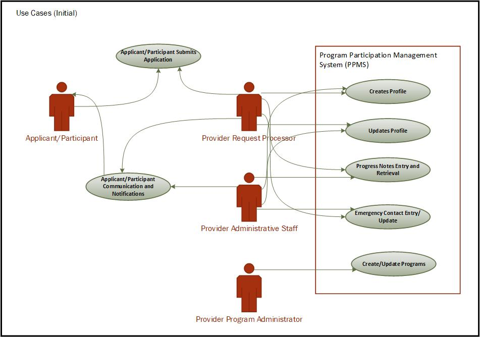
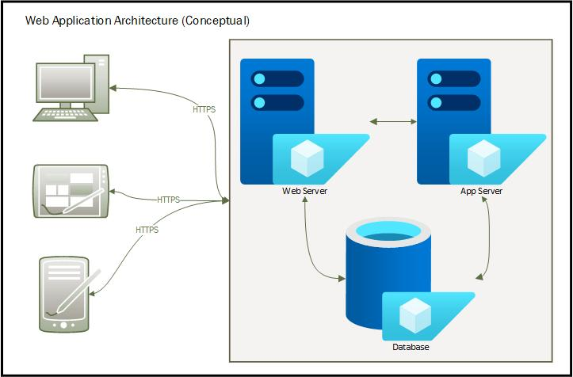
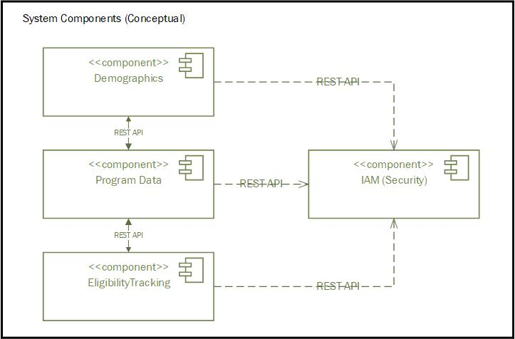
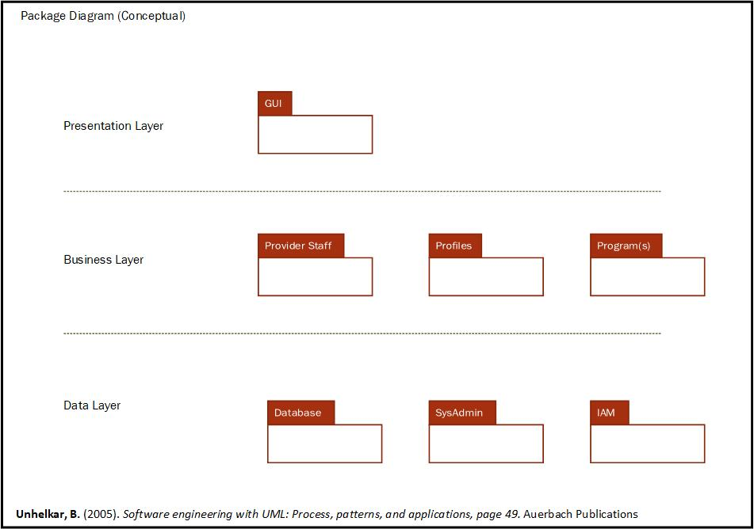

# Front Matter

**Title:** A Software Solution for Program Participation Management

**Description:** A description of the CIDM 6330-70 course project’s Requirements Specification.

**Author:** David Slack

**Created Date:** 2025-02-02

**Last Modified:** 2025-02-09

**Document Status:** Draft

**Document Version:** 1.0.0

## Introduction

### Purpose of the Document

To define the core requirements for the software solution designed for a Program Participation Management System (PPMS). This is the key component and objective of the CIDM 6330-70 course project. The project selection and approach are based on a brownfield context to examine potential improvements to a monolithic legacy system currently in use.

As a living document, it will evolve over time to reflect changes, as the course progresses and concepts are presented.

### Scope of the Project

To develop a prototype for a Program Participation Management System (PPMS) that contains participant demographics, program data, and eligibility tracking for state and federal healthcare programs.

The prototype will focus on three core functionalities:

1.  Participant Demographics Management, ensuring accurate and efficient data.
2.  Program Data Management, ensuring tracking of program participation.
3.  Program Eligibility Tracking, managing eligibility criteria for participant status associated with each supported program.
4.  Designed as a web application and expected to support the use of the Microsoft Edge browser at a minimum.

### Out of Scope

While the prototype will have the above-mentioned functionality, the development of a fully functional multi-tenant Software-as-a-Service (SaaS) architecture is considered outside the scope. This is a change in scope from the originally proposed project proposal. Implementing a multi-tenant structure requires advanced considerations, such as tenant isolation concepts that extend beyond the time and resource constraints of a single-semester course.

A web-accessible portal for program participants is also considered out of scope due to the complexity involved and time constraints.

## Table of Contents

[Front Matter](#_Toc190204624)

[Introduction](#introduction)

[Purpose of the Document](#_Toc190204626)

[Scope of the Project](#_Toc190204627)

[Out of Scope](#out-of-scope)

[Table of Contents](#_Toc190204629)

[Requirements Statements](#requirements-statements)

[User Stories](#user-stories)

[High-Level Descriptions for User Interactions in the System](#high-level-descriptions-for-user-interactions-in-the-system)

[Prioritized user needs](#prioritized-user-needs)

[Use Cases](#_Toc190204634)

[Features](#_Toc190204635)

[Gherkin Validation](#_Toc190204636)

[Specifications](#_Toc190204637)

[Concept](#_Toc190204638)

[UX Notes](#_Toc190204639)

[User Experience Guidelines](#_Toc190204640)

[Design Principles](#design-principles)

[Accessibility Considerations](#accessibility-considerations)

[Forms and Data Input](#forms-and-data-input)

[UI and System Interaction Elements](#ui-and-system-interaction-elements)

[Security and Data Integrity](#security-and-data-integrity)

[Interfaces (Controls)](#_Toc190204646)

[UI and System Interaction Elements](#ui-and-system-interaction-elements-1)

[API Endpoints (if applicable)](#api-endpoints-if-applicable)

[Behaviors](#_Toc190204649)

[Feature/Package A](#featurepackage-a)

[Feature/Package N](#_Toc190204651)

[Audience and Stakeholders](#_Toc190204652)

[Primary Stakeholders](#_Toc190204653)

[Definitions and Acronyms](#definitions-and-acronyms)

[Definitions](#_Toc190204655)

[Acronyms](#_Toc190204656)

[References](#_Toc190204657)

 

# Requirements Statements

## User Stories

**Patient Applies for Services through the application process**

1.  Submitting a Healthcare Services application

    As an applicant/participant,

    I would like to apply for state or federal healthcare services,

    to get medical state or federal healthcare services.

    **User Acceptance Criteria:**

    The applicant/participant profile exists in the database system.

    A new profile record is made if the applicant/participant is new.

    Profile details are checked for accuracy and updated if the applicant/participant already exists.

    Each applicant/participant is given a unique, system-generated ID.

2.  Handling Incomplete Applications

    As an applicant/participant,

    *I want to be notified of the status of my application status and if it is incomplete,*

    *So that I can provide the missing information or corrections.*

    **User Acceptance Criteria:**

    If required fields are missing, the system rejects the profile creation.

    The application is flagged for follow-up.

    Patients/Applicants are notified of missing information via email, text, or follow-up calls.

**Patient Profile Management**

1.  Managing patient information in the system

    *As a healthcare provider or administrative staff,*

    *I want to manage and update applicant/participant information,*

    *to ensure records are accurate.*

    **Acceptance Criteria:**

    The system retrieves the existing patient records.

    Authorized users can update or verify contact details and information.

**Applicant/Participant Progress Notes Entry and Retrieval**

1.  Documenting Patient Progress Notes

    *As a healthcare provider,*

    *I want to document and retrieve applicant/participant progress notes,*

    *So that I can track patient applications and contact history.*

    **Acceptance Criteria:**

    Providers can view past progress notes and contact details.

    Providers can add new notes and update contact information.

    Notes are timestamped.

2.  Handling System & Validation Errors in Progress Notes

    *As a healthcare provider,*

    *I want to correct errors in progress notes,*

    *So that I can ensure accurate patient records.*

    **Acceptance Criteria:**

    Providers can add an addendum instead of modifying original notes.

**Patient Communication and Notifications**

1.  Following Up on an Applicant/Participant

    *As a healthcare provider,*

    *I want to manually follow up if a patient does not respond to a notification for additional information required,*

    *So that I can ensure application processing is completed.*

    **Acceptance Criteria:**

    If a patient does not respond, a follow-up is made and noted in the progress notes.

    Staff will contact the patient manually.

**Emergency Contact Management**

1.  Updating Emergency Contact Information

    *As a healthcare provider or administrative staff,*

    *I want to store and update emergency contact details,*

    *So the applicant/participant’s emergency contact can be reached in case of an emergency.*

    **Acceptance Criteria:**

    The system retrieves and displays emergency contact details.

    Users can update or add contacts.

2.  Quick Access to Emergency Contact Information

    *As a healthcare provider,*

    *I want quick access to a patient’s emergency contact details,*

    *So that I can notify their family in case of an emergency.*

    **Acceptance Criteria:**

    Emergency contacts are accessible in urgent situations.

    Authorized personnel can retrieve details instantly.

### High-Level Descriptions for User Interactions in the System

Applicant/Patient Interactions

1.  Submit Application: The applicant provides the healthcare organization applying for one or more programs, demographic details, medical history, insurance information, and emergency contacts.
2.  Review and Process Incoming Applications: The Application Request Processor receives and reviews the applicant/participant applications for one or more programs, verifying that all required demographic details, medical history, insurance information, and emergency contacts are provided.
3.  Update Applicant Information: When identified corrections or updates are needed, the Application Request Processor or administrative staff updates demographic details, insurance information, and emergency contacts in the system.
4.  Track Application Progress: The Application Request Processor monitors the status of submitted applications to ensure they move through the review and approval process. When additional information is required, they communicate with the applicant or relevant parties to obtain the necessary details.
5.  Verify Medical History Submissions: The Application Request Processor reviews and confirms that applicants have submitted complete and accurate medical history records as part of their application. When documents are missing or need additional clarification, a Request Processor or administrative staff request further details from the applicant.
6.  Process Applications for Multiple Programs: The Application Request Processor assesses applicants who wish to apply to multiple programs to ensure preliminary eligibility criteria are met, which then facilitates the submission process for each relevant program.

Service Program Interactions

1.  Program Enrollment Management: Program Administrators manage and review program metadata and criteria for each program in the system.
2.  Assign Applicants to Programs: Eligibility Assessors or other administrative staff review applications and assign eligible applicants to respective relevant programs.

User Management and Authentication

1.  User Login and Session Management: All users log in and maintain active sessions during interactions.
2.  Role-Based Access Control: The system Administrator assigns roles to users, defining what actions they can perform.
3.  Manage User Permissions: The system Administrator configures permissions based on role assignments.

### Prioritized user needs

High, Medium, and Low are qualitative and subjective assignments based on a perceived business impact. The priority classifications P1, P2, and P3, are often used as synonyms for high, medium, and low in the bug tracking systems in use within the organization.

**High Priority (H, P1): Critical for Core System Functionality**

These are the more foundational interactions that enable the system to function and support essential workflows. This prioritization compromises between “want” and “need” perspectives.

1.  Submit Application: The system must allow applicants to submit applications, which is the starting point for all other processes.
2.  Review and Process Incoming Applications: The Application Request Processor must be able to verify and process applications efficiently to ensure the timely delivery of services.
3.  Track Application Progress: Applicants and processors need real-time status updates to avoid delays and ensure transparency.
4.  User Login and Session Management: Secure authentication and session management are required to ensure that only authorized users access the system.
5.  Assigning Applicants to Programs: Assigning applicants to programs based on preliminary eligibility ensures service program consideration.

**Medium Priority (M, P2): Enhances System Efficiency and Compliance**

These functionalities work to optimize and support accurate data management but are not immediately showstopper core operations.

1.  Verify Medical History Submissions: Ensuring applicants have complete and accurate medical history improves application approval efficiency.
2.  Update Applicant Information: Keeping records updated prevents inconsistencies, violations, or breaches in federal and state privacy regulations and administrative delays.
3.  Process Applications for Multiple Programs: Expanding options for applicants ensures better service allocation but does not block application submission.
4.  Program Enrollment Management: Administrators must manage program criteria effectively to align applicants with the right services.
5.  Role-Based Access Control: Defining user roles is essential for security and operational efficiency.

**Low Priority (L, P3): System Optimization and Maintenance**

These functions improve security, compliance, and long-term usability but are not immediate blockers for a prototype.

1.  Manage User Permissions: Customizing permissions is helpful for security but does not directly impact applicant processing.

## Use Cases

**Use Case 1: Applicant/Participant Applies for Government Healthcare Services**

**Actors:** Applicant/Participant, Request Processer Staff

**Description:** An Applicant/Participant applies for a government healthcare services program, providing demographic, eligibility-related, and contact information.

**Preconditions:**

-   The Applicant/Participant seeks enrollment in a government healthcare services program and completes the application form (by mail or in person).

**Main Flow:**

1.  The Applicant/Participant applies.
2.  The system verifies whether the Applicant/Participant already exists in the database.
3.  If the Applicant/Participant is new, a record is created. If an existing record is found, details are reviewed for updates.
4.  The application is processed, and the system verifies eligibility based on individual program criteria, including income level, residency, and other criteria.
5.  The system assigns a unique Applicant ID and securely stores all relevant information.

**Alternative Flow:**

-   If required information is missing or incomplete, the application is flagged for follow-up, and the Applicant/Participant is notified to provide the necessary details.
-   New profiles are not created if any required information (fields) is not completed.

**Use Case 2: Applicant/Participant Profile Management**

**Actors:** Administrative Staff

**Description:** Administrative staff oversee and maintain patient and applicant demographics, eligibility details, insurance information, and contact data within the system.

**Preconditions:**

-   The Applicant/Participant has applied for government healthcare services and has an existing record in the system.

**Main Flow:**

1.  The Administrative Staff are searching for the Applicant/Participant profile.
2.  The system retrieves existing data or prompts for a new entry if no record is found.
3.  The user updates or verifies the Applicant/Participant’s contact details, and eligibility status against preliminary criteria.
4.  The system saves updated information and ensures compliance with program policies.

**Alternative Flow:**

-   If outdated or invalid information is detected, the system alerts eligibility or administrative staff for review and necessary action.

**Use Case 3: Progress Notes Entry and Retrieval**

**Actors:** Healthcare Provider

**Description:** Healthcare providers record Applicant/Participant interactions and retrieve historical records within the system.

**Preconditions:**

-   An application has been submitted, and the Applicant/Participant has an existing record in the system.

**Main Flow:**

1.  The Healthcare Provider selects the Applicant/Participant record.
2.  The system retrieves and displays previous progress notes and demographic information.
3.  The Healthcare Provider documents new progress notes, including assessments, diagnoses, and treatment plans.
4.  The system timestamps and securely stores the notes in accordance with healthcare data regulations.

**Alternative Flow:**

-   If an error is found in a previous entry, an addendum is created instead of changing the original record to maintain data integrity and compliance.

**Use Case 4: Applicant/Participant Communication and Notifications**

**Actors:** Applicant/Participant, Healthcare Provider, Administrative Staff

**Description:** The healthcare provider sends follow-up notifications and other relevant communications regarding application status and healthcare services.

**Preconditions:**

-   An application has been submitted, and the Applicant/Participant has an existing record in the system.

**Main Flow:**

1.  The system detects upcoming appointments, eligibility-related actions, or necessary follow-ups.
2.  Manual notifications are sent via SMS, email, or standard mail according to the Applicant/Participant's preferred communication method.

**Alternative Flow:**

-   If the Applicant/Participant does not respond within a specified timeframe, Administrative Staff will manually follow up via phone or other contact methods.

**Use Case 5: Emergency Contact Management**

**Actors:** Applicant/Participant, Administrative Staff

**Description:** The system stores and updates emergency contact information for the Applicant/Participant.

**Preconditions:**

-   An application has been submitted, and the applicant/participant has a record already in the system.

**Main Flow:**

1.  The Administrative Staff are searching for the Applicant/Participant profile.
2.  The system retrieves and displays existing emergency contact details.
3.  The user updates, adds or removes emergency contacts as needed.
4.  The system securely saves the changes and ensures compliance with data protection regulations.

**Alternative Flow:**

-   In case of an emergency, authorized users can quickly access emergency contact details for immediate communication.

### Features

**Multi-Channel Application Submission** – Supports manual entry of applications through multiple channels, including in-person registration and assisted telephone applications, ensuring accessibility for all applicants.

**Intelligent Duplicate Record Detection** – Automatically cross-checks submitted data with existing records to prevent duplicate entries while ensuring historical records remain accurate.

**Dynamic Profile Creation & Updates** – Enables seamless onboarding for new applicants by creating records from submitted information while allowing updates for returning applicants, ensuring data remains current.

**Automated Unique ID Assignment** – Generates and assigns a unique applicant identifier upon successful submission.

**Advanced Patient Record Retrieval** – Allows authorized users to perform comprehensive searches using multiple filters (e.g., name, date of birth, application ID, etc.) to retrieve patient profiles quickly.

**Robust Profile Update & Verification** – Enables authorized staff to update, verify, and validate key applicant details such as contact information, and eligibility criteria, maintaining system integrity.

**Compliance-Focused Secure Data Storage** – Ensures all patient data is encrypted and stored securely at-rest and in-transit, complying with relevant healthcare regulations.

**Integrated Progress Notes Entry & Retrieval** – Provides healthcare providers with an intuitive interface to document new encounters while allowing easy access to past notes and history, ensuring continuity of application processing.

**Emergency Contact Storage & Updates** – Allows patients or administrative staff to add, modify, and manage emergency contact information, ensuring up-to-date details for use in critical and emergency situations.

**Rapid Emergency Contact Access for Authorized Users** – Provides healthcare providers with immediate access to emergency contact details through a secure interface, allowing timely communication in urgent medical situations.

**Enhanced Access Control & Data Security** – Implements strict role-based access control (RBAC) to ensure information is accessible only to authorized personnel, maintaining compliance with privacy and security standards.

## Gherkin Validation

Structure and content based on the blog:

*What is Gherkin Validation  
<https://www.geeksforgeeks.org/writing-scenarios-with-gherkin-syntax/>*

**Feature: Patient Applies for Services**

Scenario: Successful Application Submission   
 Given the patient seeks healthcare services   
 When the patient submits an application   
 Then the system verifies whether the patient already exists in the database   
 And if the patient is new, a record is created   
 And if the patient already exists, details are reviewed for updates   
 And the application is processed, and insurance eligibility is validated   
 And the system assigns a unique patient ID and stores relevant information

Scenario: Missing Required Information   
 Given the patient submitted an incomplete application   
 When the system processes the application   
 Then the application is flagged for follow-up

**Feature: Patient Profile Management**

Scenario: Updating Patient Profile   
 Given the patient has a record in the system   
 When the staff searches for the patient profile   
 Then the system retrieves existing data or prompts for a new entry   
 When the user updates or verifies contact details and insurance   
 Then the system saves updated information

Scenario: Outdated Insurance Information   
 Given the system detects outdated insurance information   
 Then the system alerts the billing staff

# Specifications

## Concept

The Architectural Framework of the Program Participation Management System (PPMS) features a modular architecture to guarantee scalability and maintainability. The prototype operates as a single-tenant web application that includes key components.

-   The front end is built with a modern web framework to guarantee accessibility and responsiveness.
-   The backend is a structured database-driven service that manages data storage, processing, and validation.
-   The Database Layer is a relational database that utilizes MySQL and is responsible for storing applicant records, program data, and eligibility tracking.
-   Security and compliance measures encompass Role-Based Access Control (RBAC), encrypted data storage, and logging mechanisms to ensure adherence to healthcare regulations.

The system components cover these essential areas.

-   Participant Demographics Management emphasizes creating, updating, and managing applicant profiles while ensuring that demographic details are accurate and complete. Each applicant receives a unique system-generated ID, and emergency contact information is securely stored with quick access based on roles.
-   Program Data Management enables the tracking of program participation history and the maintenance of metadata for eligibility and enrollment, as well as empowers administrative staff to review and manage assignments.
-   Program Eligibility Tracking verifies eligibility based on predefined criteria, notes incomplete applications for follow-up, and allows providers to notify applicants of application status.
-   Security and Access Control guarantees strong system protection by implementing Role-Based Access Control (RBAC) for user permissions, authentication, session management, and adherence to HIPAA and state healthcare regulations.

The Key System Workflows of PPMS streamline operations for managing healthcare program applications.

-   Application submission and verification starts with applicants submitting their healthcare services applications. The provider staff uses them to verify identities and existing records, assign a unique applicant ID, and flag incomplete applications for follow-up.
-   In Application Review and Processing, administrative staff evaluate applications for eligibility, verify applicant history and program criteria, and assign eligible applicants to appropriate programs.
-   Applicant Progress Notes Management enables providers to add and access progress notes, ensuring historical integrity through timestamping and managing errors with addendums instead of modifications.
-   Applicant communication and notifications involve the system sending updates on application status, issuing follow-up notifications to ensure timely completion, and allowing for manual staff intervention when necessary.
-   Emergency Contact Management allows administrative staff to update emergency contact information while ensuring authorized personnel can swiftly access it in urgent situations.

The Future Scalability Considerations for the Program Participation Management System (PPMS) focus on expanding its capabilities and enhancing efficiency. A key area of growth includes shifting to a multi-tenant SaaS model, allowing for broader deployment and accommodating multiple organizations within a shared infrastructure. Additionally, adopting AI-driven eligibility recommendations will optimize decision-making by automating applicant evaluations based on historical and real-time data. Furthermore, integration with state and federal healthcare databases will facilitate seamless automated data exchange, improving accuracy, compliance, and interoperability with existing healthcare systems.

System architecture considerations

This will be determined over the course’s progress and content covered.

## UX Notes

*User Experience Guidelines*

-   Create a clean, minimal interface to assist users in managing complex participant data more easily.
-   Create intuitive navigation with straightforward menu structures for easy access to demographics, program data, and eligibility tracking.
-   Offer real-time feedback, such as success or error messages and loading indicators, to boost user engagement.
-   Keep consistency in UI elements and locations (buttons, input fields, color schemes) across all pages to ensure a seamless experience.

### Design Principles

-   Mobile-responsive layout: Optimize for both desktop and tablet viewing, with a possible mobile-friendly expansion. Note: This is especially important for mobile assessors and nurses.
-   Scalability and modular design: Allow future expansion without requiring extensive rework.
-   Human-centered interaction: Emphasize user efficiency by reducing the number of clicks needed for common tasks.

### Accessibility Considerations

-   Utilize high-contrast themes and sans-serif fonts to assist users with visual impairments.
-   Ensure that keyboard navigation is accessible for interactive elements.

### Forms and Data Input

-   Utilize drop-down selections rather than free text whenever feasible to standardize data. entry.
-   Organize all drop-down selection lists in alphabetical order, arranged in descending format when possible.

### UI and System Interaction Elements

-   Implement role-based access control (RBAC) to guarantee that various user levels (e.g., admin, caseworker, reviewer) possess the necessary permissions.

### Security and Data Integrity

-   Session timeout and re-authentication protect against unauthorized access.
-   Keep audit logs to monitor changes to participant records. Note: This is a SOC Type 2 requirement, though it is not essential for the prototype.
-   Ensure data encryption is applied both during transit and at rest to safeguard sensitive information. Note: While this is a SOC Type 2 requirement, it is not required for the prototype.

## Interfaces (Controls)

### UI and System Interaction Elements

The controls and elements of the User Interface (UI) for system interaction include:

-   **Navigation Menu**: Accesses various system modules, including demographics, program management, and reports.
-   **Forms and Input Fields**: Standardized text fields, dropdowns, date pickers, and checkboxes for inputting data.
-   **Action Buttons**: Common controls such as "Save," "Edit," "Delete," "Submit," and "Approve" facilitate user interactions.
-   **Modals & Pop-ups**: Utilized for confirmation dialogs, warnings, and quick data entry without leaving a page.
-   **Role-Based Access Control (RBAC) Panel**: Manages permissions and access rights for various user roles.

### API Endpoints (if applicable)

-   **Program Management API:** Facilitates CRUD operations (Create, Read, Update, Delete) for managing program data.
-   **Eligibility Verification API:** Determines and verifies a participant’s eligibility according to program criteria.

## Behaviors

This will be determined over the course’s progress and content covered. 

### Feature/Package A

-   Description of the feature
-   UML diagrams (Use Case, Sequence, Class, etc.)

### Feature/Package N

- Description of the feature

- UML diagrams (Use Case, Sequence, Class, etc.)

  

## Stakeholders

### Primary Stakeholders

In addition to the two expected stakeholders, the course instructor, and the course student, the expected stakeholders of a working system are:

1.  **Healthcare IT Administrators**: Supervise the integration and implementation of the system within the existing infrastructure.
2.  **Program Managers and Coordinators**: Oversee participant enrollment, assess program eligibility, and report on data.
3.  **Caseworkers and Social Workers**: Utilize the system to monitor participant demographics, program status, and service eligibility.
4.  **Compliance and Regulatory Staff**: Ensure the system align with federal and state regulations for healthcare and data security, specifically SOC Type II.
5.  **Healthcare Providers (Physicians, Therapists, Caregivers)**: Review participant information to coordinate care and monitor medical histories.
6.  **Internal Finance and Billing Departments**: Utilize program participation data for reimbursement tracking and financial reporting.

**Internal Technical and Development Stakeholders**

1.  **Software Developers and Engineers**: Design, develop, and evaluate the application’s functionality.
2.  **UX/UI Designers**: Design an intuitive and accessible user experience for various stakeholders.
3.  **Cloud and Infrastructure Engineers**: Evaluate the viability of cloud deployment regarding scalability and security. This involves the organization's CIO/CTO and the Director of Information Technology Infrastructure Services.
4.  **Cybersecurity Specialists**: Ensure compliance with HIPAA, data encryption, and system security best practices.

**End Users and General Audience**

1.  **Program Participants and Families**: May interact indirectly with the system to verify program status or update information. However, a web-accessible portal for Program Participants is not included in the scope of this prototype.
2.  **Government Agencies (State and Federal Health Departments)**: To assess participant status, population distributions, program involvement, and engagement levels.

## Definitions and Acronyms

The definitions and acronyms described herein were included based on the course materials and references listed in the references section.

### Definitions

**Applicant/Participant:** An individual applying for a federal or state healthcare program is considered an applicant if it is their first time applying. They are regarded as a participant if they are currently involved in one or more programs. An individual can submit applications for programs regardless of their current participation in another program.

**Program Participation Management System**: A software solution aimed at streamlining participant demographic tracking, managing program eligibility, and centralizing data reporting for state and federal healthcare programs.

**Multi-Tenant Architecture**: A cloud-based system architecture that allows multiple organizations (tenants) to share a single software infrastructure while ensuring data separation.

**Participant Demographics Management**: A system function that enables the collection, storage, and retrieval of participant-related data (demographics), including personal details, medical history, and guardian information.

**Program Data Management**: A system function that facilitates the collection, storage, and retrieval of healthcare service programs such as Medicaid, while managing datasets across multiple healthcare service programs to enable efficient participant membership querying, reporting, and analysis.

**Eligibility Tracking**: A feature that monitors and validates participant qualifications for specific programs based on predefined rules, such as age, income, medical history, or condition and status.

**Software-as-a-Service (SaaS)**: A cloud-based software delivery model in which applications are hosted and managed by a provider and accessed via the internet.

**Cloud Deployment**: Hosting applications and data on cloud platforms like AWS or Azure allows for scalability, security, and remote accessibility.

**Role-Based Access Control (RBAC)**: A security model that limits system access according to user roles and permissions.

**User Stories**: High-level descriptions of system interactions from the end-user's perspective are used in software development to define functional requirements.

**Gherkin Syntax**: A structured language utilized in Behavior-Driven Development (BDD) to outline test scenarios using a Given-When-Then format.

**Use Cases**: a structured representation of system interactions describes how users achieve specific goals, including actors, preconditions, steps, and postconditions. API Endpoints are access points in a web service that allow different software applications to. communicate and exchange data.

**System Architecture**: The conceptual design and structure of a software system, encompassing its components, data flows, and interactions.

**Data Standardization**: The process of structuring data into a consistent format to enhance interoperability across various systems and programs.

**Interoperability**: The capacity of various systems and applications to exchange and utilize data smoothly and promptly.

### Acronyms

**SaaS**: Software as a Service

**HIPAA**: Health Insurance Portability and Accountability Act

**UX/UI**: User Experience / User Interface

**API**: Application Programming Interface

**SQL**: Structured Query Language

**AWS**: Amazon Web Services

**PaaS**: Platform as a Service

**DBMS**: Database Management System

**RBAC**: Role-Based Access Control

**ETL**: Extract, Transform, Load

## References

The following references have been utilized in creating the artifacts for this project.

1.  **Bab, J.** (2025). *CIDM 6330-70 course materials*. Paul and Virginia Engler College of Business, West Texas A&M University.
2.  **Slack, D.** (2025), drawing from his expertise and firsthand experience with the proprietary existing system (Liberty IS), played a crucial role in identifying and defining the system requirements, ensuring alignment with the organization’s operational needs and industry’s best practices.
3.  **Buelta, J.** (2022). *Python architecture patterns*. Packt Publishing.
4.  **Richards, M., & Ford, N.** (2020). *Fundamentals of software architecture: An engineering approach.* O'Reilly Media.
5.  **Unhelkar, B.** (2005). *Software engineering with UML: Process, patterns, and applications.* Auerbach Publications
6.  **Dennis, A., Wixom, B. H., & Tegarden, D.** (2020). *Systems analysis and design: An object-oriented approach with UML (6th ed.).* Wiley.
7.  **Schulmeyer, G. G., & McManus, J. I.** (1998). *Handbook of software quality assurance (3rd ed.).* Prentice Hall.
8.  **Golding, T.** (2024). *Building multi-tenant SaaS applications.* O'Reilly Media.
