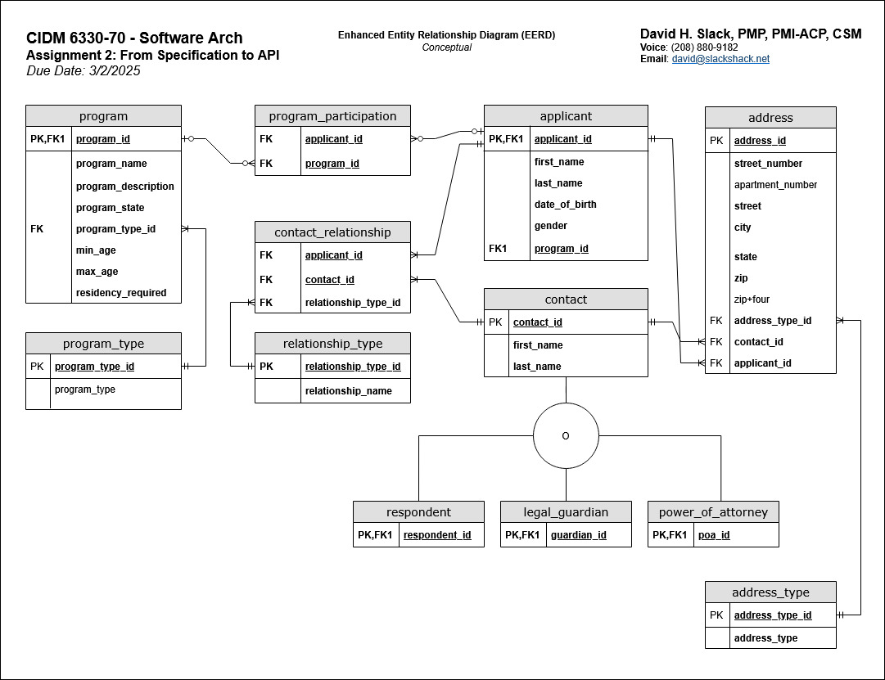
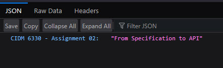
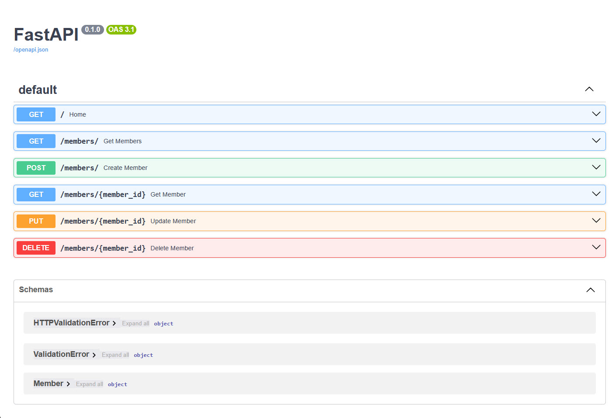
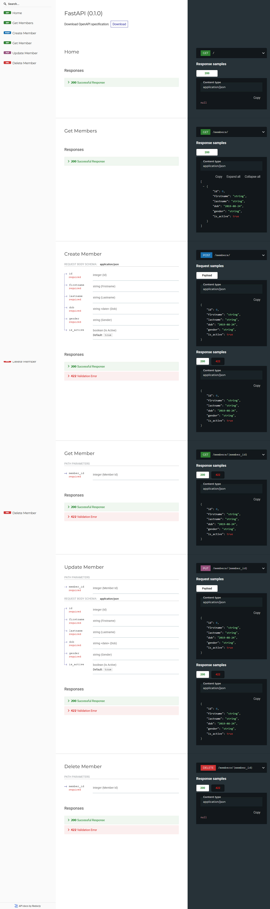

# Front Matter

**Title:** CIDM 6330-70: Assignment 02 - From Specification to API

**Description:** A description of the CIDM 6330-70 course project’s Requirements Specification.

**Author:** David Slack

**Created Date:** 2025-03.02

**Last Modified:** 2025-03.02

**Document Status:** Final

**Document Version:** 1.0.0


# Assignment Deliverables:
## Enhanced Entity Relationship Diagram (EERD)


## Python Code (main.py)
* main.py file also available

```python

"""
Script Name: [main.py]
Author: David H. Slack
Copyright: @ 2025, David H. Slack
Date Created: 2025.03.01
Last Modified: 2025.03.01
Version: 1.0.0.0000
	
Description: 
		Creates an API using Python and FastAPI for the CIDM 6330 - Assignment 02, 
		From Specification to API Deliverables. This API is designed to support the
		course project's Entity-Relationship Diagram (ERD) by implementing at least
		one entity from the domain.
		
Instructor course notes on execution:
		We can use FastAPI to create a basic HTTP/RESTful API in Python.
		Assumes that the following packages have been installed useing pip:
    	1. pip install fastapi
    	2. pip install uvicorn

		Or, we can use the built-in fastapi command to run the API, but we'll need an additional package installation:
    	1. pip install "fastapi[standard]"

		Altnatively, you we can use fastapi diectly from the command line:
    	1. uvicorn main:app --reload

Access API documentation:
    Open Swagger UI: http://127.0.0.1:8000/docs
    Open Redoc UI: http://127.0.0.1:8000/redoc

"""

# =============================================
# Import necessary modules
# =============================================
# Import the os and sys modules, though they are not used they
# are included as part of my normal python template.
# import os
# import sys

# Additional imports here

from fastapi import FastAPI # Import FastAPI to create the web application.
from fastapi import HTTPException # Import HTTPException to handle HTTP errors.
from pydantic import BaseModel # Import Pydantic's model for request/response validation.
from datetime import date # Import date to handle member date of birth (DOB) fields.
from typing import List # Import List for type hinting when returning a list of members.


# In-memory storage for members
# FastAPI Documentation - Dependency Injection and State:
# FastAPI allows in-memory storage using Python lists, dictionaries, or global variables.
# Reference: https://fastapi.tiangolo.com/advanced/dependencies/

# Altering "members" to "members" to minimize confusion between "members" and "members".
members = []
member_id_counter = 1

app = FastAPI()

# Pydantic Model for entity member
class member(BaseModel):
    id: int
    firstname: str
    lastname: str
    dob: date
    gender: str
    is_active: bool = True

# In-memory database with 10 example members. 
# Each member stored as a dictionary
# Transition to using MySQL should have at least 50.
members = [
    {"id": 1, "firstname": "Alice", "lastname": "Johnson", "dob": "1992-06-15", "gender": "Female", "is_active": True},
    {"id": 2, "firstname": "Bob", "lastname": "Smith", "dob": "1988-11-22", "gender": "Male", "is_active": False},
    {"id": 3, "firstname": "Charlie", "lastname": "Brown", "dob": "1995-04-08", "gender": "Non-binary", "is_active": True},
    {"id": 4, "firstname": "Diana", "lastname": "King", "dob": "1980-07-30", "gender": "Female", "is_active": True},
    {"id": 5, "firstname": "Edward", "lastname": "White", "dob": "1999-02-14", "gender": "Male", "is_active": False},
    {"id": 6, "firstname": "Fiona", "lastname": "Adams", "dob": "1993-09-27", "gender": "Female", "is_active": True},
    {"id": 7, "firstname": "George", "lastname": "Hill", "dob": "1985-12-03", "gender": "Male", "is_active": True},
    {"id": 8, "firstname": "Hannah", "lastname": "Scott", "dob": "2000-05-19", "gender": "Female", "is_active": False},
    {"id": 9, "firstname": "Isaac", "lastname": "Thomas", "dob": "1997-03-10", "gender": "Male", "is_active": True},
    {"id": 10, "firstname": "Julia", "lastname": "Martin", "dob": "1990-08-25", "gender": "Female", "is_active": True},
]


# =============================================
# Establish the API Endpoints
# =============================================
# Reference: FastAPI. (n.d.). First Steps. FastAPI. Retrieved March 1, 2025, from https://fastapi.tiangolo.com/tutorial/first-steps/

@app.get("/")
def home():
    return {"CIDM 6330 - Assignment 02": "From Specification to API"} # The project title

# Create a new member, if not existing
@app.post("/members/", response_model=member)
def create_member(member: member):
    # Check if member ID already exists
    if any(a["id"] == member.id for a in members):
        raise HTTPException(status_code=400, detail="member already exists")
    
    members.append(member.dict())
    return member

# Get all members in demo list.
@app.get("/members/", response_model=List[member])
def get_members():
    return members

# Get an member by ID.
# Determine how to support for multi-field search later.
@app.get("/members/{member_id}", response_model=member)
def get_member(member_id: int):
    for member in members:
        if member["id"] == member_id:
            return member
    raise HTTPException(status_code=404, detail="member was not found, try another search?")

# Update an member, search is by ID
# Reference: FastAPI. (n.d.). Body - Updates. FastAPI. Retrieved March 1, 2025, from https://fastapi.tiangolo.com/tutorial/body-updates/
@app.put("/members/{member_id}", response_model=member)
def update_member(member_id: int, updated_member: member):
    for index, member in enumerate(members):
        if member["id"] == member_id:
            members[index] = updated_member.dict()
            return updated_member
    raise HTTPException(status_code=404, detail="member not found, try another?")

# Delete an member by ID
# Reference: FastAPI. (n.d.). First Steps. FastAPI. Retrieved March 1, 2025, from https://fastapi.tiangolo.com/tutorial/first-steps/
@app.delete("/members/{member_id}")
def delete_member(member_id: int):
    global members
    members = [member for member in members if member["id"] != member_id]
    return {"message": "member deleted successfully"}


```
## Root Response Message: http://127.0.0.1:8000/
### Browser Screen Capture


## Open Swagger UI: http://127.0.0.1:8000/docs
### Browser Screen Capture


## Open Redoc UI: http://127.0.0.1:8000/redoc
### Browser Screen Capture



# References:
## Course Text:
Buelta, J. (2022). Python architecture patterns: Master API design, event-driven structures, and package management in Python. Packt Publishing.
https://www.amazon.com/Python-Architecture-Patterns-event-driven-structures/dp/1801819998

## Course References:
1. Tiangolo. (n.d.). FastAPI. FastAPI Documentation. Retrieved February 24, 2025, from https://fastapi.tiangolo.com/
2. Tiangolo. (n.d.). FastAPI reference. FastAPI Documentation. Retrieved February 24, 2025, from https://fastapi.tiangolo.com/reference/
3. Pydantic. (n.d.). Pydantic documentation. Retrieved February 27, 2025, from https://docs.pydantic.dev/latest/
4. Pydantic. (n.d.). BaseModel API. Pydantic Documentation. February 27, 2025, from https://docs.pydantic.dev/latest/api/base_model/

## Additional Text References:

1. Matthes, E. (2019). Python crash course: A hands-on, project-based introduction to programming (2nd ed.). No Starch Press. 
2. Richards, M., & Ford, N. (2020). Fundamentals of software architecture: An engineering approach. O'Reilly Media. 
3. Unhelkar, B. (2005). Software engineering with UML: Process, patterns, and applications. Auerbach Publications 
4. Dennis, A., Wixom, B. H., & Tegarden, D. (2020). Systems analysis and design: An object-oriented approach with UML (6th ed.). Wiley. 
5. Schulmeyer, G. G., & McManus, J. I. (1998). Handbook of software quality assurance (3rd ed.). Prentice Hall.
6. Golding, T. (2024). Building multi-tenant SaaS applications. O'Reilly Media.
7. Voron, F. (2023). Building data science applications with FastAPI - Second Edition: Develop, manage, and deploy efficient machine learning applications with Python. Packt Publishing.


