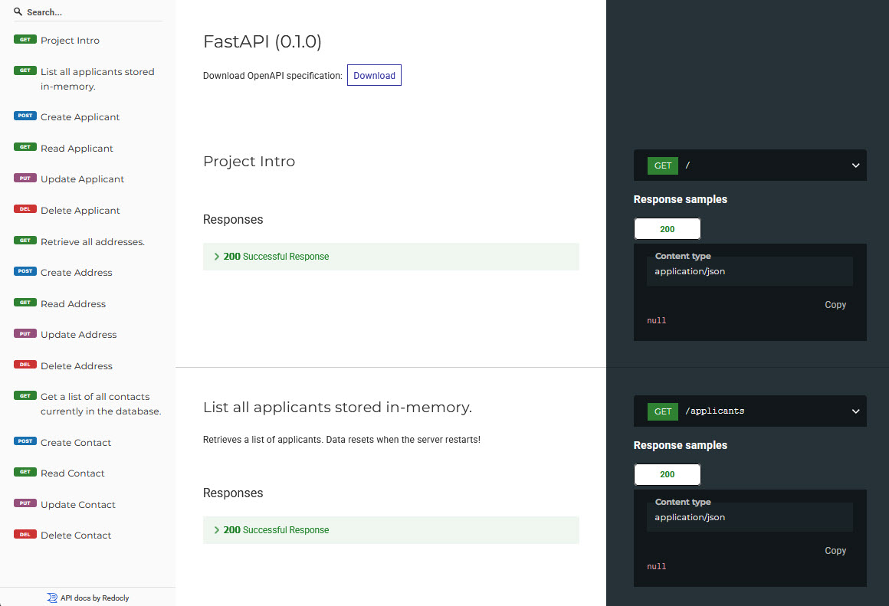

# Front Matter

**Title:** CIDM 6330-70: Assignment 03 - Extend Your API with a Repository

**Description:** A description of the CIDM 6330-70 course project’s repository implementation.

**Author:** David Slack

**Created Date:** 2025-03.16

**Last Modified:** 2025-03.16

**Document Status:** Final

**Document Version:** 1.0.0

# Assignment Deliverables:
1.	Implement a Repository for your project/API
2.	Create three instantiation contexts for your API 
    1.	SQLModel Repository
    2.	CSV Repository
    3.	In-Memory Repository
3.	Modify your FastAPI-driven API to use your repository


## Python Code (main.py)
* main.py file also available

```python
"""
Script Name: [main.py]
Author: David H. Slack
Copyright: @ 2025, David H. Slack
Date Created: 2025.03.14
Last Modified: 2025.03.14
Version: 1.0.0.0000
	
Description: 
		Creates an API using Python and FastAPI for the CIDM 6330 - Assignment 
        03, Extend Your API with a Repository Deliverables. This API is designed
        to support the course project's Entity-Relationship Diagram (ERD) by 
        implementing three instantiation contexts for the API:

            1.	SQLModel Repository
            2.	CSV Repository
            3.	In-Memory Repository
		
Instructor course notes:
    The result of your work should closely mirror what you see in the SQLModel
    "Heros" FastAPI/Pydantic tutorial. 

    API CRUD + Repository Persistence
    The purpose of this assignment is to have a full API + Persistence means of
    simple state changes for your system. Note that there is no business logic
    present as of yet, we are simply facilitating CRUD operations for API + 
    Respository-driven persistence

References:
    1. Tiangolo, S. (2018). FastAPI: Fast (high-performance), web framework for 
       building APIs with Python 3.6+. Retrieved from https://fastapi.tiangolo.com
    2. Pydantic. (n.d.). Data validation and settings management using Python type 
       hints. Retrieved from https://docs.pydantic.dev
    3. Van Rossum, G., & Python Software Foundation. (2023). Python documentation: 
       Data structures. Retrieved from 
       https://docs.python.org/3/tutorial/datastructures.html
    4. https://www.w3schools.com/python/pandas/default.asp
    5. The Pandas Development Team. (2023). pandas.DataFrame — pandas 2.0.3 
       documentation. Retrieved from https://pandas.pydata.org/docs/reference/api/pandas.DataFrame.html

Course reference & example: 
    https://github.com/ahuimanu/CIDM6330/blob/SPRING2025/CIDM6330-Spring2025/Evolution_02_Repository/2025/main.py
    https://github.com/ahuimanu/CIDM6330/blob/SPRING2025/CIDM6330-Spring2025/Evolution_02_Repository/2025/generic.py
    https://github.com/ahuimanu/CIDM6330/blob/SPRING2025/CIDM6330-Spring2025/Evolution_02_Repository/2025/repository.py

Access API documentation:
    Open Swagger UI: http://127.0.0.1:8000/docs
    Open Redoc UI: http://127.0.0.1:8000/redoc
"""

# =============================================
# Import necessary modules
# =============================================
# Import the os and sys modules.
import os # May not be used, import anyway.
import sys # May not be used, import anyway.

# Additional imports here
from datetime import date  # Needed for DOB handling
from pydantic import BaseModel  # Model validation
from fastapi import HTTPException  # Error handling
from fastapi import FastAPI  # Web framework
from typing import List  # List typing 

# Using individual files for each repository type.
# Import the InMemoryPersistence class from the in_memory_persistence.py (Applicant)
from in_memory_persistence import InMemoryPersistence 

# Import the CSVPersistence class from csv_persistence.py (Address)
from csv_persistence import CSVPersistence

 # Import the SQLitePersistence class from mysql_persistence.py (Contact) 
 # Using SQLite due to course examples. 
from db_persistence import SQLitePersistence


app = FastAPI()

# Initialize the persistence layers.
in_memory_db = InMemoryPersistence()
csv_db = CSVPersistence("address.csv")
sqlite_db = SQLitePersistence()


# =============================================
# Establish the API Endpoints (routes).
# =============================================
# Reference: FastAPI. (n.d.). First Steps. FastAPI. Retrieved March 1, 2025, from https://fastapi.tiangolo.com/tutorial/first-steps/

# Set the root messaging for the project.
# =============================================
@app.get("/")
def project_intro():
    return {"CIDM 6330 - Assignment 03": "Extend Your API with a Repository"} # The project title


# =============================================
# Create, Read, Update, Delete (CRUD) methods as:
# list (all), create, read, update, delete, for consistency.
# =============================================

# In-Memory Persistence (Applicant).
# =============================================

# Get all applicants.
# https://swagger.io/specification/?sbsearch=route%20summary, used here after.
@app.get("/applicants", 
         summary="List all applicants stored in-memory.", 
         description="Retrieves a list of applicants. Data resets when the server restarts!")
def list_applicants():
    applicants = in_memory_db.list_applicants()

    if not applicants:
        return {"get_all_applicants error:": "No applicants found."}

    return {"applicants": applicants}


# Create a new applicant.
@app.post("/applicant/")
def create_applicant(applicant: dict):
    result = in_memory_db.create_applicant(applicant) 

    return {"create_applicant": "New applicant added.", "data": result}


# Retrieve an applicant's details.
@app.get("/applicant/{applicant_id}")
def read_applicant(applicant_id: int):
    applicant = in_memory_db.read_applicant(applicant_id)

    if not applicant:
        # https://docs.python.org/3/library/string.html#custom-string-formatting, used here after.
        return {"get_applicant error": "Sorry, can not find an applicant with ID {}.".format(applicant_id)}

    return {"applicant": applicant}


# Update an existing applicant's data
@app.put("/applicant/{applicant_id}")
def update_applicant(applicant_id: int, applicant: dict):
    updated_applicant = in_memory_db.update_applicant(applicant_id, applicant)

    # If applicant ID does not exist
    if not updated_applicant:
        return {"update_applicant error:": "Could not find the applicant with ID {}.".format(applicant_id)}

    return {"update_applicant": "Applicant updated successfully.", "data": updated_applicant}

# Delete an applicant.
@app.delete("/applicant/{applicant_id}")
def delete_applicant(applicant_id: int):
    deleted = in_memory_db.delete_applicant(applicant_id)

    # If applicant ID does not exist
    if not deleted:
        return {"delete_applicant error:": "Could not find the applicant with ID {}.".format(applicant_id)}

    return {"deleted_applicant": "Applicant {} deleted successfully.".format(applicant_id)}


# CSV Persistence (Address).
# =============================================

# Get all addresses from the csv file.
# https://swagger.io/specification/?sbsearch=route%20summary, used here after.
@app.get("/addresses", 
         summary="Retrieve all addresses.", 
         description="Returns a full list of stored addresses from the CSV file.")
def list_addresses():
    addresses = csv_db.list_addresses()

    # If no addresses exist.
    if not addresses:
        return {"get_all_addresses error:": "No addresses found. Check the csv file."}

    return {"addresses": addresses}


# Add a new address to the csv file.
@app.post("/address/")
def create_address(address: dict):
    result = csv_db.create_address(address)
    return {"create_address error:": "Address successfully added to csv file.", "data": result}


# Get a specific address by its ID from the csv file.
@app.get("/address/{address_id}")
def read_address(address_id: int):
    address = csv_db.read_address(address_id)
    if not address:
        return {"get_address error:": "Couldn not find the address with ID {}.".format(address_id)}

    return {"address": address}


# Update an existing address in the csv file.
@app.put("/address/{address_id}")
def update_address(address_id: int, address: dict):
    updated_address = csv_db.update_address(address_id, address)
    if not updated_address:
        return {"update_address error:": "No address found with ID {}. Update failed.".format(address_id)}

    return {"update_address": "Address updated successfully.", "data": updated_address}


# Delete an address from the CSV database
@app.delete("/address/{address_id}")
def delete_address(address_id: int):
    deleted = csv_db.delete_address(address_id)
    if not deleted:
        return {"delete_address error:": "Address ID {} was not found. Check the ID.".format(address_id)}

    return {"delete_address": "Address with ID {} deleted.".format(address_id)}


# SQLite Persistence (Contact).
# =============================================

# Get a list of all contacts currently in the database.
# https://swagger.io/specification/?sbsearch=route%20summary, used here after.
@app.get("/contacts", response_model=list, 
         summary="Get a list of all contacts currently in the database.", 
         description="Retrieve all contact records from the database.")
def list_contacts():
    contact = sqlite_db.list_contacts()
    if not contact:
        return {"list_contacts error:": "Contacts not found!"}
    
    return contact


# Create a new contact in the database.
@app.post("/contact/")
def create_contact(contact: dict):
    new_contact = sqlite_db.create_contact(contact)

    return {"create_contact": "New contact added.", "data": new_contact}


# Retrieve a contact by ID from the database.
@app.get("/contact/{contact_id}")
def read_contact(contact_id: int):
    contact = sqlite_db.read_contact(contact_id)

    if not contact:
        return {"get_contact error:": "Contact not found with ID {}. Check the database.".format(contact_id)}

    return {"contact": contact}


# Update an existing contact in the database.
@app.put("/contact/{contact_id}")
def update_contact(contact_id: int, contact: dict):
    updated_contact = sqlite_db.update_contact(contact_id, contact)

    # If contact doesn't exist in the database.
    if not updated_contact:
        return {"update_contact error:": "No contact found with ID {}. No update.".format(contact_id)}

    return {"update_contact": "Contact updated successfully.", "data": updated_contact}


# Delete a contact from the database.
@app.delete("/contact/{contact_id}")
def delete_contact(contact_id: int):
    deleted = sqlite_db.delete_contact(contact_id)

    if not deleted:
        return {"delete_contact error:": "Contact with ID {} not found.".format(contact_id)}

    return {"delete_contact": "Contact with ID {} deleted.".format(contact_id)}
```

## Python Code (in_memory_persistence.py)
* in_memory_persistence.py file also available

```python

"""
Script Name: [in_memory_persistence.py]
Author: David H. Slack
Copyright: @ 2025, David H. Slack
Date Created: 2025.03.14
Last Modified: 2025.03.14
Version: 1.0.0.0000
	
Description: 
	The in_memory_persistence.py module for the in-memory data storage to manage
    applicant records. The persistence is designed to allow temporary data 
    storage, meaning that all records will be lost when the application restarts. 
"""

# =============================================
# Import necessary modules
# =============================================
# Import the os and sys modules, even if they may not used they
# are included as part of my normal python template.
# import os
# import sys

# Additional imports here
from fastapi import FastAPI # Import FastAPI to create the web application.
from fastapi import HTTPException # Import HTTPException to handle HTTP errors.
from pydantic import BaseModel # Import Pydantic's model for request/response validation.
from datetime import date # Import date to handle member date of birth (DOB) fields.
from typing import List # Import List for type hinting when returning a list of members.

app = FastAPI()

class InMemoryPersistence:

    # Initializes the in-memory database for applicants.
    def __init__(self):
 
        self.applicants = {}  # Dictionary to store applicants in memory
        self.current_id = 1   # Set the counter for the first Applicant_ID

        # Predefined members, with 10 initial members.
        # https://www.analyticsvidhya.com/blog/2024/02/how-to-create-a-list-of-dictionaries-in-python/
        members = [
            {"FirstName": "Alice", "LastName": "Johnson", "DoB": "1992-06-15", "Gender": "Female", "ResidencyState": "Idaho"},
            {"FirstName": "Bob", "LastName": "Smith", "DoB": "1988-11-22", "Gender": "Male", "ResidencyState": "Idaho"},
            {"FirstName": "Charlie", "LastName": "Brown", "DoB": "1995-04-08", "Gender": "Non-binary", "ResidencyState": "Idaho"},
            {"FirstName": "Diana", "LastName": "King", "DoB": "1980-07-30", "Gender": "Female", "ResidencyState": "Idaho"},
            {"FirstName": "Edward", "LastName": "White", "DoB": "1999-02-14", "Gender": "Male", "ResidencyState": "Idaho"},
            {"FirstName": "Fiona", "LastName": "Adams", "DoB": "1993-09-27", "Gender": "Female", "ResidencyState": "Idaho"},
            {"FirstName": "George", "LastName": "Hill", "DoB": "1985-12-03", "Gender": "Male", "ResidencyState": "Idaho"},
            {"FirstName": "Hannah", "LastName": "Scott", "DoB": "2000-05-19", "Gender": "Female", "ResidencyState": "Idaho"},
            {"FirstName": "Isaac", "LastName": "Thomas", "DoB": "1997-03-10", "Gender": "Male", "ResidencyState": "Idaho"},
            {"FirstName": "Julia", "LastName": "Martin", "DoB": "1990-08-25", "Gender": "Female", "ResidencyState": "Idaho"},
        ]

        # Load the initial applicants.
        for member in members:
            member["Applicant_ID"] = self.current_id  # Assign a unique Applicant_ID.
            self.applicants[self.current_id] = member  # Store applicant in dictionary.
            self.current_id += 1 # At the end of the load this should be set to 11.


# =============================================
# Create, Read, Update, Delete (CRUD) methods as:
# list (all), create, read, update, delete, for consistency.
# =============================================


    # Get a list of all the applicants.
    def list_applicants(self):
 
        if not self.applicants:
            raise HTTPException(status_code = 404, detail = "No applicants found in memory!")

        return list(self.applicants.values())  # Return all applicants as a list of dictionaries


    # Create a new applicant.
    def create_applicant(self, applicant: dict):
        
        applicant["Applicant_ID"] = self.current_id # Should be set to 11 for 1st create.
        self.applicants[self.current_id] = applicant
        self.current_id += 1

        return {"create_applicant": "The applicant was created.", "applicant": applicant}


    # Get an applicant by their ID.
    def read_applicant(self, applicant_id: int):
        
        if applicant_id in self.applicants:
            return self.applicants[applicant_id]
        
        raise HTTPException(status_code = 404, detail = "Applicant ID was not found.")


    # Update an existing applicant details.
    def update_applicant(self, applicant_id: int, updated_applicant: dict):
       
        if applicant_id in self.applicants:
            updated_applicant["Applicant_ID"] = applicant_id
            self.applicants[applicant_id] = updated_applicant
            
            return {"update_applicant": "The applicant was updated.", "applicant": updated_applicant}
        
        raise HTTPException(status_code = 404, detail = "Applicant ID was not found.")


    # Delete an applicant by their ID.
    def delete_applicant(self, applicant_id: int):
 
        if applicant_id in self.applicants:
            del self.applicants[applicant_id]

            return {"delete_applicant": "Applicant deleted."}
        
        raise HTTPException(status_code = 404, detail = "Applicant ID was not found.")
```

## Python Code (csv_persistence.py)
* csv_persistence.py file also available

```python
"""
Script Name: [csv_persistence.py]
Author: David H. Slack
Copyright: @ 2025, David H. Slack
Date Created: 2025.03.15
Last Modified: 2025.03.15
Version: 1.0.0.0000
	
Description: 
	The csv_persistence.py module provides the flat-file CSV-based storage 
    system to manage address records. The persistence provides storing, 
    retrieving, updating, and deleting address information in a CSV file.
"""

# =============================================
# Import necessary modules
# =============================================
# Import the os and sys modules, even if they may not used they
# are included as part of my normal python template.
import os
import sys

# Additional imports here
from fastapi import FastAPI # Import FastAPI to create the web application.
from fastapi import HTTPException # Import HTTPException to handle HTTP errors.
from pydantic import BaseModel # Import Pydantic's model for request/response validation.
from datetime import date # Import date to handle member date of birth (DOB) fields.
from typing import List # Import List for type hinting when returning a list of members.
import pandas as pd # Import Pandas for CSV file manipulation

app = FastAPI()

# Define the csv file location (path).
CSV_FILE = "address.csv"

# Define the csv column headers.
COLUMNS = [
    "Address_ID",  # Unique identifier for each address (Primary Key).
    "Street_No",  # House number.
    "Street",  # Street name.
    "City",  # City of the address.
    "State", # State of the address.
    "Zip",  # Zip code of the address.
    "Type",  # Address type classification (Home, Work, etc.).
    "OwnerID",  # Contact owner identifier (Foreign Key to Contact entity).
    "OwnerType",  # Owner type classification (Self, Parent, Guardian, etc.).
]


# The class for managing address records using the csv file.
class CSVPersistence:

    # If the file does not exist, create a new one with headers.
    # Watch it... the 1st attempt created an empty file by mistake!
    # Drop the use of subfolders for now!
    def __init__(self, file_path=CSV_FILE):

        self.file_path = file_path
        if not os.path.exists(self.file_path):
            df = pd.DataFrame(columns=COLUMNS)
            df.to_csv(self.file_path, index=False)

    # Load the file.
    def _load_data(self):
        return pd.read_csv(self.file_path)

    # Need to read more on dataframe concepts.
    # https://www.geeksforgeeks.org/python-pandas-dataframe/
    def _save_data(self, df):
        df.to_csv(self.file_path, index=False)


# =============================================
# Create, Read, Update, Delete (CRUD) methods as:
# list (all), create, read, update, delete, for consistency.
# =============================================


    # Get all addresses in the csv file.
    def list_addresses(self):
        df = self._load_data()  # Load data from the csv file.

        if df.empty:
            raise HTTPException(status_code = 404, detail = "No addresses found.")

        return df.to_dict(orient="records")


    # Create a new address.
    def create_address(self, address: dict):
        df = self._load_data()

        # Generate a unique Address_ID
        # Find the current max ID and increment for tha new one.
        address_id = df["Address_ID"].max() + 1 if not df.empty else 1
        address["Address_ID"] = address_id

        # Append (concat) the new address
        # Per:
        # Stack Overflow User. (2023, April 7). Error: DataFrame object has no 
        # attribute 'append' [Online forum post]. Stack Overflow. Retrieved from
        # https://stackoverflow.com/questions/75956209/error-dataframe-object-has-no-attribute-append
        df = df.concat(address, ignore_index=True)
        self._save_data(df)

        # return address
        return {"create_address": "The address was created.", "address": address}


    # Get an address by ID.
    def read_address(self, address_id: int):
        df = self._load_data()
        record = df[df["Address_ID"] == address_id]

        # Error if not a valid address_id.
        if record.empty:
            raise HTTPException(status_code = 404, detail = "Address ID was not found. Confirm ID.")

        return record.to_dict(orient="records")[0]

    # Update an address.
    def update_address(self, address_id: int, updated_address: dict):
        df = self._load_data()

        # Confirm provided address id is valid.
        if address_id not in df["Address_ID"].values:
            raise HTTPException(status_code = 404, detail = "Address ID was not found.")

        # Update the address record
        df.loc[df["Address_ID"] == address_id, list(updated_address.keys())] = list(updated_address.values())
        self._save_data(df)

        return {"update_address": "The address was updated successfully.", "updated_address": updated_address}


    # Delete an address. 
    # Ensure a backup of the file prior to testing!
    def delete_address(self, address_id: int):
        df = self._load_data()

        if address_id not in df["Address_ID"].values:
            raise HTTPException(status_code = 404, detail = "Address ID was not found. Confirm ID")

        # Remove the address from csv file.
        df = df[df["Address_ID"] != address_id]
        self._save_data(df)

        return {"delete_address": "Address deleted"}
```

## Python Code (db_persistence.py)
* db_persistence.py file also available

```python
"""
Script Name: [db_persistence.py]
Author: David H. Slack
Copyright: @ 2025, David H. Slack
Date Created: 2025.03.15
Last Modified: 2025.03.15
Version: 1.0.0.0000
	
Description: 
	The db_persistence.py module provides the SQLite-based storage system for
    managing contact records. It provides the interaction with a MySQL database.

References:
https://sqlitebrowser.org/

Note:
    Switched to SQLite from MySQL per examples in course materials and lecture.

"""

# =============================================
# Import necessary modules
# =============================================
# Import the os and sys modules, even if they may not used they
# are included as part of my normal python template.
import os
import sys

# Additional imports here
from fastapi import FastAPI # Import FastAPI to create the web application.
from fastapi import HTTPException # Import HTTPException to handle HTTP errors.
from pydantic import BaseModel # Import Pydantic's model for request/response validation.
from datetime import date # Import date to handle member date of birth (DOB) fields.
from typing import List # Import List for type hinting when returning a list of members.
import sqlite3 # Import the SQLite3 module for interacting with a SQLite database.


# The class for managing contact records using SQLite database.
class SQLitePersistence:

    # SQLite connection, creates the table if it does not exist.
    def __init__(self, db_path="contacts.db"):

        self.db_path = db_path
        self.initialize_db()  # Ensure the database, table, and contacts exist.
        self.connection = sqlite3.connect(self.db_path, check_same_thread=False) # Make the connection.
        """
        Added: check_same_thread=False to connection.
        This Stack overflow question (post) resolved an error in my code regarding
        this error: 

            sqlite3.ProgrammingError: SQLite objects created in a thread can only 
            be used in that same thread. The object was created in thread id 29404
            and this is thread id 38672.
        
        Stack Overflow User. (2018, January 12). Objects created in a thread can 
        only be used in that same thread [Online forum post]. Stack Overflow. 
        Retrieved from https://stackoverflow.com/questions/48218065/objects-created-in-a-thread-can-only-be-used-in-that-same-thread
        """

        self.connection.row_factory = sqlite3.Row  # Enables dictionary-like access to rows.
        self.cursor = self.connection.cursor() 
       

    def initialize_db(self):
         # Check if the database file exists, create it if not.
        db_exists = os.path.exists(self.db_path)

        # Connect to SQLite and create the db file if it does not exist.
        connection = sqlite3.connect(self.db_path)
        cursor = connection.cursor()

        if not db_exists:
            print("Database and table not found, created successfully.")

        # Create 'contact' table if it does not exist. It shouldn't at first run.
        cursor.execute("""
            CREATE TABLE IF NOT EXISTS contact (
                Contact_ID INTEGER PRIMARY KEY AUTOINCREMENT,
                First_Name TEXT NOT NULL,
                Last_Name TEXT NOT NULL,
                Phone TEXT NOT NULL,
                Applicant_Relationship TEXT NOT NULL
            )
        """)
        connection.commit()

        # Check if the first 10 contacts exist, if not add them.
        cursor.execute("SELECT COUNT(*) FROM contact")
        count = cursor.fetchone()[0]

        if count < 10:
            print("Inserting default contacts as defined in db_persistence.py")
            self.insert_default_contacts(cursor, connection)

        connection.commit()
        connection.close()


    # Insert the first 10 contacts when they do not exist.
    def insert_default_contacts(self, cursor, connection):

        contacts = [
            ("Alice", "Johnson", "555-123-4567", "Parent"),
            ("Bob", "Smith", "555-234-5678", "Guardian"),
            ("Charlie", "Brown", "555-345-6789", "Sibling"),
            ("Diana", "King", "555-456-7890", "Spouse"),
            ("Edward", "White", "555-567-8901", "Parent"),
            ("Fiona", "Adams", "555-678-9012", "Guardian"),
            ("George", "Hill", "555-789-0123", "Sibling"),
            ("Hannah", "Scott", "555-890-1234", "Parent"),
            ("Isaac", "Thomas", "555-901-2345", "Guardian"),
            ("Julia", "Martin", "555-012-3456", "Spouse"),
        ]
        
        cursor.executemany(
            "INSERT INTO contact (First_Name, Last_Name, Phone, Applicant_Relationship) VALUES (?, ?, ?, ?)",
            contacts
        )
        print("Default contacts not found in db, inserted successfully.")


# =============================================
# Create, Read, Update, Delete (CRUD) methods as:
# list (all), create, read, update, delete, for consistency.
# =============================================

    # Get all contact records in the database in the contacts table.
    def list_contacts(self):
 
        self.cursor.execute("SELECT * FROM contact")  # Select all records.
        results = self.cursor.fetchall()  # Fetch result.

        if not results:
            # This shouldn't happen if the code above for the checks functions correctly.
            raise HTTPException(status_code = 404, detail = "No contacts found in the database. Crumbs!")

        return [dict(row) for row in results]  # Convert rows to list.


    # Create a new contact record.
    def create_contact(self, contact: dict):

        sql = "INSERT INTO contact (First_Name, Last_Name, Phone, Applicant_Relationship) VALUES (?, ?, ?, ?)"
        self.cursor.execute(sql, (contact["First_Name"], contact["Last_Name"], contact["Phone"], contact["Applicant_Relationship"]))
        self.connection.commit()

        # Get the last inserted ID.
        contact["Contact_ID"] = self.cursor.lastrowid
        return contact


    # Get a contact record by Contact_ID.
    def read_contact(self, contact_id: int):
 
        self.cursor.execute("SELECT * FROM contact WHERE Contact_ID = ?", (contact_id,))
        result = self.cursor.fetchone()

        if not result:
            raise HTTPException(status_code = 404, detail = "Contact not found, are you sure you have records!")

        return dict(result)


    # Update an existing contact by Contact_ID.
    def update_contact(self, contact_id: int, updated_contact: dict):

        sql = "UPDATE contact SET First_Name = ?, Last_Name = ?, Phone = ?, Applicant_Relationship = ? WHERE Contact_ID = ?"
        self.cursor.execute(sql, (updated_contact["First_Name"], updated_contact["Last_Name"], updated_contact["Phone"], updated_contact["Applicant_Relationship"], contact_id))
        self.connection.commit()

        if self.cursor.rowcount == 0:
            raise HTTPException(status_code = 404, detail = "Contact not found")

        return updated_contact


    # Delete a contact by Contact_ID.
    def delete_contact(self, contact_id: int):

        self.cursor.execute("DELETE FROM contact WHERE Contact_ID = ?", (contact_id,))
        self.connection.commit()

        if self.cursor.rowcount == 0:
            raise HTTPException(status_code = 404, detail = "Contact not found")

        return {"delete_contact": "Contact deleted"}
```

## Root Response Message: http://127.0.0.1:8000/
### Browser Screen Capture


## Open Swagger UI: http://127.0.0.1:8000/docs
### Browser Screen Capture


## Open Redoc UI: http://127.0.0.1:8000/redoc
### Browser Screen Capture



# References:
## Course Text:
Buelta, J. (2022). Python architecture patterns: Master API design, event-driven structures, and package management in Python. Packt Publishing.
https://www.amazon.com/Python-Architecture-Patterns-event-driven-structures/dp/1801819998

## Course References:
1. Tiangolo. (n.d.). FastAPI. FastAPI Documentation. Retrieved February 24, 2025, from https://fastapi.tiangolo.com/
2. Tiangolo. (n.d.). FastAPI reference. FastAPI Documentation. Retrieved February 24, 2025, from https://fastapi.tiangolo.com/reference/
3. Pydantic. (n.d.). Pydantic documentation. Retrieved February 27, 2025, from https://docs.pydantic.dev/latest/
4. Pydantic. (n.d.). BaseModel API. Pydantic Documentation. February 27, 2025, from https://docs.pydantic.dev/latest/api/base_model/

## Additional Text References:

1. Matthes, E. (2019). Python crash course: A hands-on, project-based introduction to programming (2nd ed.). No Starch Press. 
2. Richards, M., & Ford, N. (2020). Fundamentals of software architecture: An engineering approach. O'Reilly Media. 
3. Unhelkar, B. (2005). Software engineering with UML: Process, patterns, and applications. Auerbach Publications 
4. Dennis, A., Wixom, B. H., & Tegarden, D. (2020). Systems analysis and design: An object-oriented approach with UML (6th ed.). Wiley. 
5. Schulmeyer, G. G., & McManus, J. I. (1998). Handbook of software quality assurance (3rd ed.). Prentice Hall.
6. Golding, T. (2024). Building multi-tenant SaaS applications. O'Reilly Media.
7. Voron, F. (2023). Building data science applications with FastAPI - Second Edition: Develop, manage, and deploy efficient machine learning applications with Python. Packt Publishing.
8. Tiangolo, S. (2018). FastAPI: Fast (high-performance), web framework for building APIs with Python 3.6+. Retrieved from https://fastapi.tiangolo.com
9. Pydantic. (n.d.). Data validation and settings management using Python type hints. Retrieved from https://docs.pydantic.dev
10. Van Rossum, G., & Python Software Foundation. (2023). Python documentation: Data structures. Retrieved from https://docs.python.org/3/tutorial/datastructures.html
11. https://www.w3schools.com/python/pandas/default.asp 
12. The Pandas Development Team. (2023). pandas.DataFrame — pandas 2.0.3 documentation. Retrieved from https://pandas.pydata.org/docs/reference/api/pandas.DataFrame.html


