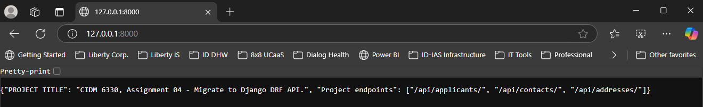
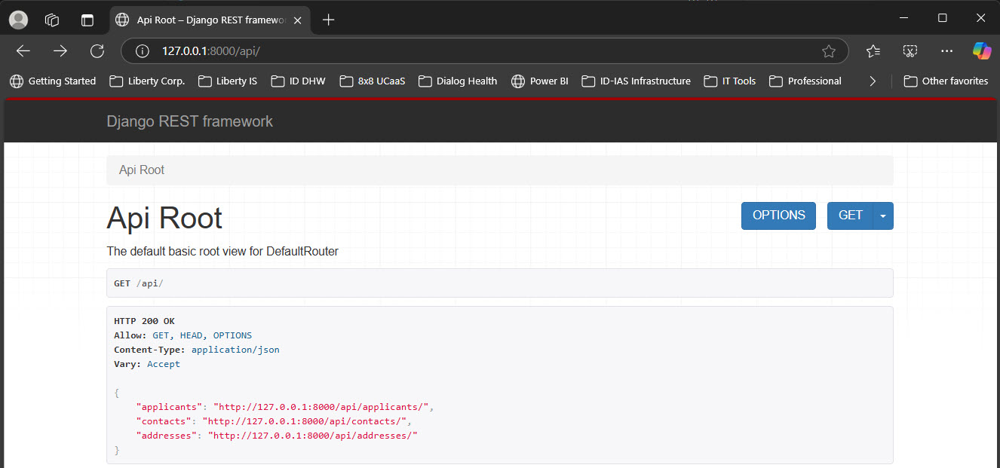
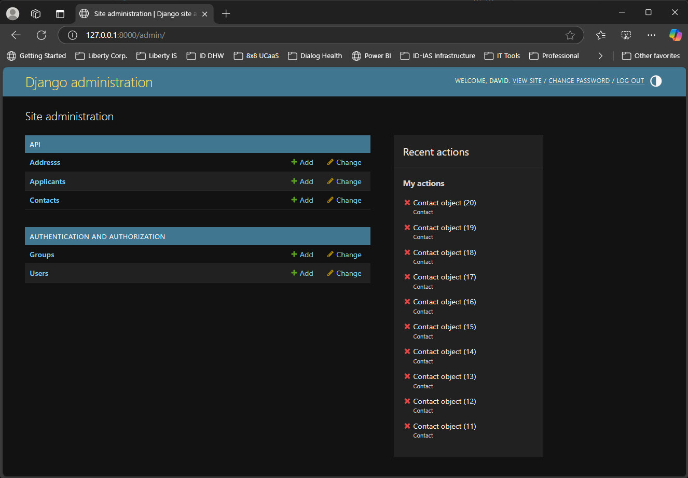
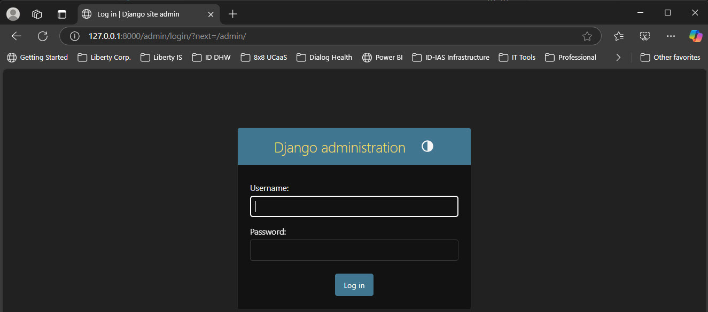
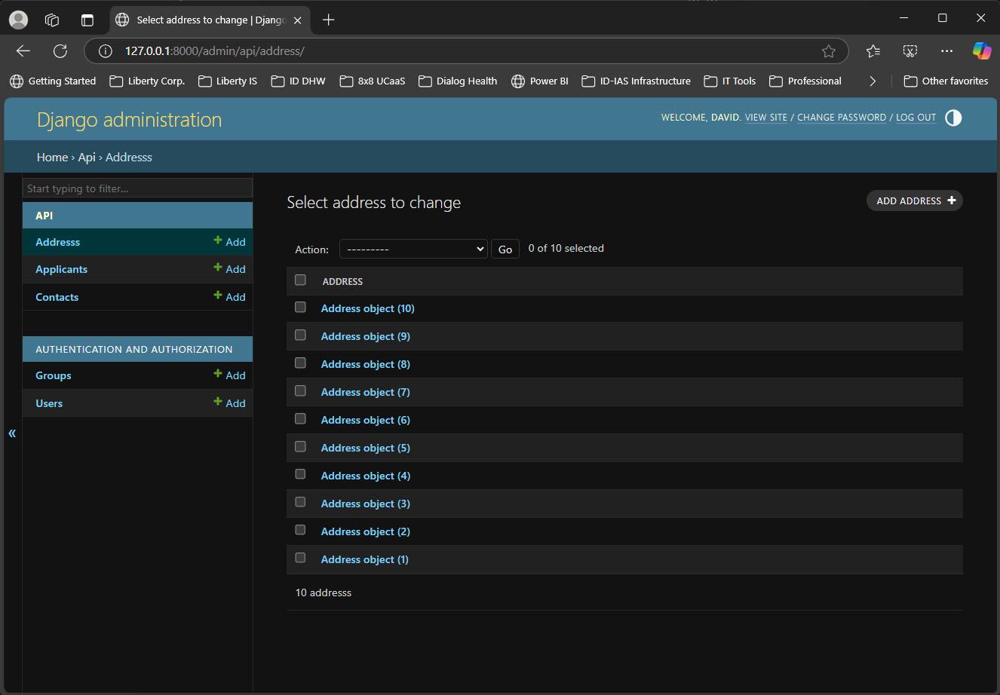
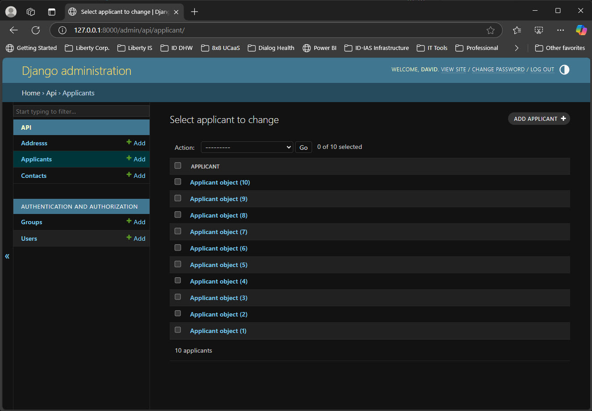
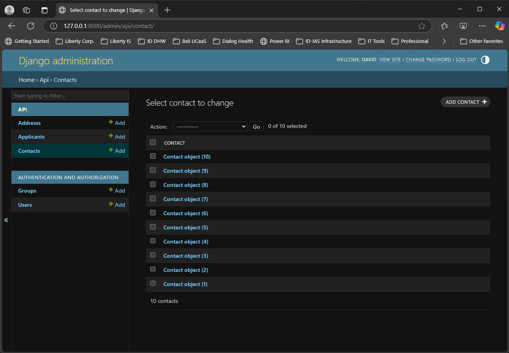
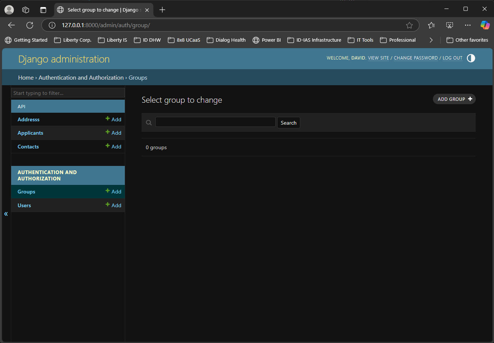
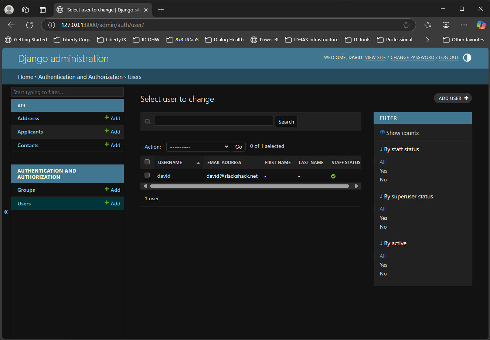

# West Texas A&M University - CIDM 6330-70

**Title:** Assignment 04 - Migrate to Django

**Description:** A evolution of the CIDM 6330-70 course project’s repository implementation to implement Django ORM and Rest Framework.

**Author:** David Slack

**Created Date:** 2025.04.05

**Last Modified:** 2025.04.05

**Document Status:** Final

**Document Version:** 1.0.0

# Assignment Descripton & Deliverables (per the course instructions):
In the previous two assignments, you created an API and also a persistence strategy with the Repository pattern.  For this assignment, we'll translate to Django and the Django REST Framework, which are mature solutions that benefit from many of the best practices we are studying in the book.  For this advance we'll

- Learn how to translate from our FastAPI API to one provided within Django
- Learn about what a stable and mature web application framework provides
- Understand how both the API and persistence are handled by Django

### Steps to Take

Here are the steps for this assignment
1.	Implement a Repository for your project/API
2.	Translate your API into one that uses the Django REST Framework
3.	Use the built-in Django Object-Relational Mapping (O/RM) rather than the Repository we previously crafted.

Our good friends at GFG have some basic guidance to follow: https://www.geeksforgeeks.org/how-to-create-a-basic-api-using-django-rest-framework/
The QuickStart at the DRF website is helpful too: https://www.django-rest-framework.org/tutorial/quickstart/

### API CRUD + Repository Persistence
The purpose of this assignment is to leverage a mature web application framework such as Django to reap the benefits of mature and stable "monolithic" implementations. Note that we will hold off on implementing business logic until we explore event-driven paradigms.


# Approach:
To complete this assignment, I took a learn-by-doing/hands-on and structured approach. First, I went through all the course materials—textbook, lectures, videos, and any extra resources that were recommended. In addition I followed the tutorials outlinded below as a starting point for working with Django REST Framework. I also completed the official DRF quickstart tutorial for creating a simple API that lets admin users manage users and groups. The final step is where I started a new project using Django REST Framework and integrated the structures built in **Assignment 03: Extend Your API with a Repository**.

*The https://www.geeksforgeeks.org/ tutorials and documentation were a substantial aid in understanding the Django REST Framework.*

1. Review the course materials: text, lectures, videos, and recommended supplemental references.
2. Completed the Django tutorial "Building Web APIs with Django Rest Framework: A Beginner's Guide" available at: https://betterstack.com/community/guides/scaling-python/introduction-to-drf/?utm_source=chatgpt.com
3. Completed the following Django tutorials available at: https://www.geeksforgeeks.org/django-tutorial/
    - ToDo webapp using Django
    - ~~Django News App~~ - *Not enough time to complete.*
    - ~~E-Commerce Website Using Django~~ - *Not enough time to complete. But looks like an interesting project.*
4. Completed the tutorial to "create a simple API to allow admin users to view and edit the users and groups in the system" available at: https://www.django-rest-framework.org/tutorial/quickstart/#project-setup
5. Completed the tutorial "How to Create a basic API using Django Rest Framework?" available at: https://www.geeksforgeeks.org/how-to-create-a-basic-api-using-django-rest-framework/
6. Create a new project using the Djanog REST Framework and integrate the prevous structures from **Assignment 03: Extend Your API with a Repository** into the project using https://www.django-rest-framework.org/tutorial/quickstart/ as a reference.


# Django Rest Framework Project: **drf_hw4**
Following are the series of commands, executed in sequence, to create the project, establish the virtual environment, run the application, and evaluate the results and capture the appropriate screen captures.

## Project setup
Follows the example at: https://www.django-rest-framework.org/tutorial/quickstart/
### 1. Create the project directory
- mkdir **drf_hw4**
- cd **drf_hw4**

### 2. Create a virtual environment to isolate the package dependencies locally
This is to avoid dependency conflicts with other the other Python projects on the system. Once the viratual environment is activated, the prompt should change to show (venv), the name of the virtual environment. Any Python packages installed now will be local to this project.

- python -m venv venv
- env\Scripts\activate # env\Scripts\activate (Windows), env\Scripts\activate (Linux)

### 3. Install Django and Django REST framework into the virtual environment
- pip install djangorestframework       

### 4. Set up a new project with a single application
Start a new Django project inside the current folder ("."). 
- django-admin startproject **drf_hw4** .  
- cd **drf_hw4**

#### This creates the following folder structure:
*manage.py is the entry point for most Django commands, i.e. "python manage.py makemigrations" and "python manage.py migrate" that will be used later.*
- .\manage.py                 
- .
- .\drf_hw4
- .\drf_hw4\asgi.py
- .\drf_hw4\__init__.py
- .\drf_hw4\quickstart
- .\drf_hw4\quickstart\migrations
- .\drf_hw4\quickstart\migrations\__init__.py
- .\drf_hw4\quickstart\models.py
- .\drf_hw4\quickstart\__init__.py
- .\drf_hw4\quickstart\apps.py
- .\drf_hw4\quickstart\admin.py
- .\drf_hw4\quickstart\tests.py
- .\drf_hw4\quickstart\views.py
- .\drf_hw4\settings.py
- .\drf_hw4\urls.py
- .\drf_hw4\wsgi.py
- .\venv
- .\venv\ 

### 5. Create the new Django app named "drf_hw4"
This is where I'll build models, serializers, views, etc. to support the application.

- django-admin startapp drf_hw4

New folders and files are created.
- models.py                 # Define database models
- views.py                  # Define API and logic
- serializers.py (you'll add manually for DRF)
- urls.py (optional to add app-specific routes)
- admin.py, apps.py, tests.py, migrations/

## Run and Validate the Application
This project will be executed from within VS Code using a cmd.exe terminal. Note that the default is a PowerShell termninal.

Once in the cmd.exe terminal, navigate to the appropriate project folder, in this case:
cd "C:\Users\david\OneDrive\Documents\! WTAMU\4. CIDM 6330-70 - Software Arch\Assignment 4\drf_hw4\"

Create a Virtual Environment for execution and activate it.
- python -m venv venv
- venv\Scripts\activate

Install Django and Django REST Framework and any other desired packages. Note: Installs only for this vm instance.
- pip install django djangorestframework

Apply the project Migrations to Create the Database
Run Django's migration system to set up the database (SQLite):
- python manage.py makemigrations
- python manage.py migrate

Load my Initial Test Data Leveraged Homework 3.
- python manage.py shell
- from api.load_test_data import run_all
- run_all()
- exit()

Create a Superuser to test with
- python manage.py createsuperuser

Now Run the Development Server to Confirm Everything is in Place

*Expected Output:*

    Watching for file changes with StatReloader
    Performing system checks...

    System check identified no issues (0 silenced).
    April 06, 2025 - 16:44:23
    Django version 5.2, using settings 'drf_hw4.settings'
    Starting development server at http://127.0.0.1:8000/
    Quit the server with CTRL-BREAK.

    WARNING: This is a development server. Do not use it in a production setting. Use a production WSGI or ASGI server instead.
    For more information on production servers see: https://docs.djangoproject.com/en/5.2/howto/deployment/


## Access the Application URLs with a Browser
- API Root: http://127.0.0.1:8000/
- API Endpoints: http://127.0.0.1:8000/api/
- Django Admin: http://127.0.0.1:8000/admin/

# Project Contents & Artifacts

## API Root: http://127.0.0.1:8000/ Image


## API Endpoints: http://127.0.0.1:8000/api/ Image


## Django Admin: http://127.0.0.1:8000/admin/ Images

### Django Admin


### Django Admin, Login


### Django Admin, Addresses


### Django Admin, Applicants


### Django Admin, Contacts


### Django Admin, Groups


### Django Admin, Users



# Python Code
All the files are also available in the zip extract of the repository. Below are key code files for reference.

**api\models.py**

```python
"""
# Leveraged from: Django ORM – Inserting, Updating & Deleting Data: https://www.geeksforgeeks.org/django-orm-inserting-updating-deleting-data/

from django.db import models

# Create your models here.

# Import Django's base model functionality
from django.db import models

# Writing Models — Django Docs: https://docs.djangoproject.com/en/stable/topics/db/models/
# Field Types Reference: https://docs.djangoproject.com/en/stable/ref/models/fields/

# Applicant model
class Applicant(models.Model):
    FirstName = models.CharField(max_length=100)
    LastName = models.CharField(max_length=100)
    DoB = models.DateField()
    Gender = models.CharField(max_length=20)
    ResidencyState = models.CharField(max_length=50)

# Contact model
class Contact(models.Model):
    First_Name = models.CharField(max_length=100)
    Last_Name = models.CharField(max_length=100)
    Phone = models.CharField(max_length=20)
    Applicant_Relationship = models.CharField(max_length=50)

# Address model
class Address(models.Model):
    Street_No = models.CharField(max_length=10)
    Street = models.CharField(max_length=100)
    City = models.CharField(max_length=50)
    State = models.CharField(max_length=20)
    Zip = models.CharField(max_length=10)
    Type = models.CharField(max_length=50)
    OwnerID = models.IntegerField()
    OwnerType = models.CharField(max_length=50)
"""
```

**api\serializers.py**

```python
"""
# Serializers — Django REST Framework: https://www.django-rest-framework.org/api-guide/serializers/
# This is also touched upon in a couple of the tutorial projects.

# Django REST Framework serializers
from rest_framework import serializers
from .models import Applicant, Contact, Address

# Applicant model
class ApplicantSerializer(serializers.ModelSerializer):
    class Meta:
        model = Applicant
        fields = '__all__'

# Contact model
class ContactSerializer(serializers.ModelSerializer):
    class Meta:
        model = Contact
        fields = '__all__'

# Address model
class AddressSerializer(serializers.ModelSerializer):
    class Meta:
        model = Address
        fields = '__all__'
"""
```

**api\urls.py**

```python
"""
# Import URL functions and DRF routers
from django.urls import path, include
from rest_framework.routers import DefaultRouter

# Import ViewSets
from .views import ApplicantViewSet, ContactViewSet, AddressViewSet

# Instantiate DRF's default router
router = DefaultRouter()

# Register each model ViewSet with the router
router.register(r'applicants', ApplicantViewSet)
router.register(r'contacts', ContactViewSet)
router.register(r'addresses', AddressViewSet)

# Include the router-generated URLs in urlpatterns
urlpatterns = [
    path('', include(router.urls)),
]
"""
```

**api\views.py**

```python
"""
# Leveraged from: https://www.django-rest-framework.org/tutorial/quickstart/#views
# and: The completed the following Django "ToDo" tutorials available at: https://www.geeksforgeeks.org/django-tutorial/

from django.shortcuts import render
from rest_framework import viewsets
from .models import Applicant, Contact, Address
from .serializers import ApplicantSerializer, ContactSerializer, AddressSerializer

# Applicant model
class ApplicantViewSet(viewsets.ModelViewSet):
    queryset = Applicant.objects.all()
    serializer_class = ApplicantSerializer

# Contact model
class ContactViewSet(viewsets.ModelViewSet):
    queryset = Contact.objects.all()
    serializer_class = ContactSerializer

# Address model
class AddressViewSet(viewsets.ModelViewSet):
    queryset = Address.objects.all()
    serializer_class = AddressSerializer
"""
```


# References:
## Course Text:
Buelta, J. (2022). Python architecture patterns: Master API design, event-driven structures, and package management in Python. Packt Publishing.
https://www.amazon.com/Python-Architecture-Patterns-event-driven-structures/dp/1801819998

## Course References:
1. Tiangolo. (n.d.). FastAPI. FastAPI Documentation. Retrieved February 24, 2025, from https://fastapi.tiangolo.com/
2. Tiangolo. (n.d.). FastAPI reference. FastAPI Documentation. Retrieved February 24, 2025, from https://fastapi.tiangolo.com/reference/
3. Pydantic. (n.d.). Pydantic documentation. Retrieved February 27, 2025, from https://docs.pydantic.dev/latest/
4. Pydantic. (n.d.). BaseModel API. Pydantic Documentation. February 27, 2025, from https://docs.pydantic.dev/latest/api/base_model/

## Additional Text References:

1. Matthes, E. (2019). Python crash course: A hands-on, project-based introduction to programming (2nd ed.). No Starch Press. 
2. Richards, M., & Ford, N. (2020). Fundamentals of software architecture: An engineering approach. O'Reilly Media. 
3. Unhelkar, B. (2005). Software engineering with UML: Process, patterns, and applications. Auerbach Publications 
4. Dennis, A., Wixom, B. H., & Tegarden, D. (2020). Systems analysis and design: An object-oriented approach with UML (6th ed.). Wiley. 
5. Schulmeyer, G. G., & McManus, J. I. (1998). Handbook of software quality assurance (3rd ed.). Prentice Hall.
6. Golding, T. (2024). Building multi-tenant SaaS applications. O'Reilly Media.
7. Voron, F. (2023). Building data science applications with FastAPI - Second Edition: Develop, manage, and deploy efficient machine learning applications with Python. Packt Publishing.
8. Tiangolo, S. (2018). FastAPI: Fast (high-performance), web framework for building APIs with Python 3.6+. Retrieved from https://fastapi.tiangolo.com
9. Pydantic. (n.d.). Data validation and settings management using Python type hints. Retrieved from https://docs.pydantic.dev
10. Van Rossum, G., & Python Software Foundation. (2023). Python documentation: Data structures. Retrieved from https://docs.python.org/3/tutorial/datastructures.html
11. https://www.w3schools.com/python/pandas/default.asp 
12. The Pandas Development Team. (2023). pandas.DataFrame — pandas 2.0.3 documentation. Retrieved from https://pandas.pydata.org/docs/reference/api/pandas.DataFrame.html


