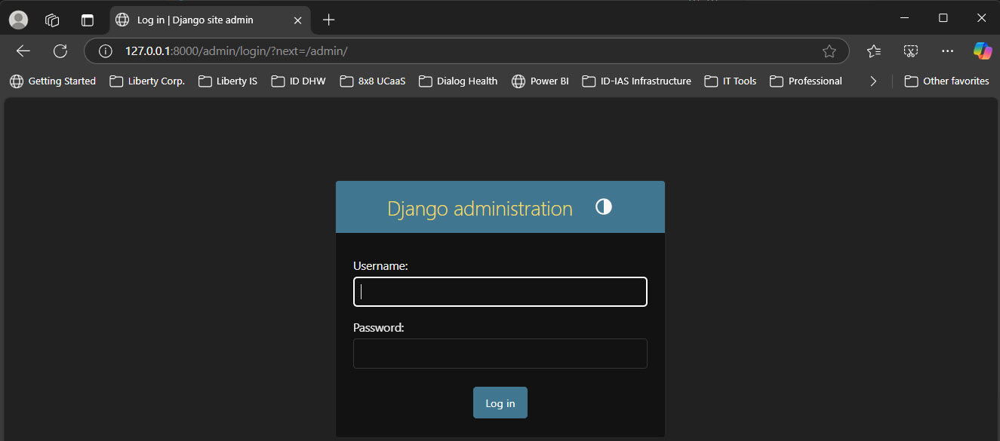
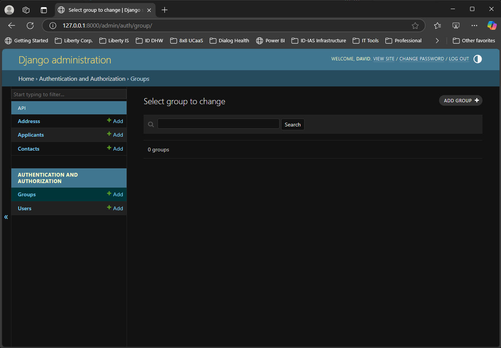

# West Texas A&M University - CIDM 6330-70

**Title:** Final Project, https://github.com/slackshacker/CIDM6330-Spring2025-Slack

**Description:** The final evolution of the CIDM 6330-70 course project, presenting a culmination of the previous evolutions 1 to 5.

**Author:** David Slack

**Created Date:** 2025.-5.04

**Last Modified:** 2025.05.04

**Document Status:** Final

**Document Version:** 1.0.0

#

# Table of Contents

[Front Matter](#west-texas-am-university---cidm-6330-70)

[Assignment Description (per the course outline instructions):](#assignment-description-per-the-course-outline-instructions)

- [Instructions](#instructions)

- [Course Project Final Deliverables:](#course-project-final-deliverables)

- [Evolution 0: Domain Specification and UML Modeling](#evolution-0-domain-specification-and-uml-modeling)

- [Evolution 1: An updated Requirements Specification](#evolution-1-an-updated-requirements-specification)

- [Evolution 2: An updated API](#evolution-2-an-updated-api)

- [Evolution 3: Skipping](#evolution-3-skipping)

- [Evolution 4: Migrate to Django](#evolution-4-migrate-to-django)

- [Evolution 5: Full Django + Tests](#evolution-5-full-django--tests)

[My Approach:](#my-approach)

- [Django Rest Framework Project: **CIDM6330**](#django-rest-framework-project-cidm6330)

- [Project setup](#project-setup)

- [Run and Validate the Application](#run-and-validate-the-application)

[Access the Application URLs with a Browser](#access-the-application-urls-with-a-browser)

[Project Contents & Artifacts (Deliverables)](#project-contents--artifacts-deliverables)

- [Domain Driven Design](#domain-driven-design)

- [The Project (Ubiquitous Language) Glossary](#the-project-ubiquitous-language-glossary)

- [Test-Driven Development](#test-driven-development)

- [Test-Driven Development](#test-driven-development-1)

[API Endpoint List](#api-endpoint-list)

[Project Screen Captures](#project-screen-captures)

- [Root View: http://127.0.0.1:8000/ Image](#root-view-http1270018000-image)

- [Root View API Root: http://127.0.0.1:8000/api/ Image](#root-view-api-root-http1270018000api-image)

- [Root View API Root Address List: http://127.0.0.1:8000/api/addresses/ Image](#root-view-api-root-address-list-http1270018000apiaddresses-image)

- [Root View API Root Applicant List: http://127.0.0.1:8000/api/applicants/ Image](#root-view-api-root-applicant-list-http1270018000apiapplicants-image)

- [Root View API Root Applicant Instance: http://127.0.0.1:8000/api/applicants/{id}/ Image](#root-view-api-root-applicant-instance-http1270018000apiapplicantsid-image)

- [Root View API Root Group Instance: http://127.0.0.1:8000/api/groups/{id}/ Image](#root-view-api-root-group-instance-http1270018000apigroupsid-image)

- [Root View API Root User List: http://127.0.0.1:8000/api/users/ Image](#root-view-api-root-user-list-http1270018000apiusers-image)

- [Root View API Root User Instance: http://127.0.0.1:8000/api/users/{id}/ Image](#root-view-api-root-user-instance-http1270018000apiusersid-image)

- [Django Admin Login: http://127.0.0.1:8000/admin/ Image](#django-admin-login-http1270018000admin-image)

- [Django Admin: http://127.0.0.1:8000/admin/ Image](#django-admin-http1270018000admin-image)

- [Django Admin Groups: http://127.0.0.1:8000/admin/ Image](#django-admin-groups-http1270018000admin-image)

- [Django Admin Users: http://127.0.0.1:8000/admin/ Image](#django-admin-users-http1270018000admin-image)

- [Django Admin Task Results: http://127.0.0.1:8000/admin/ Image](#django-admin-task-results-http1270018000admin-image)

- [Django Admin Addresses: http://127.0.0.1:8000/admin/ Image](#django-admin-addresses-http1270018000admin-image)

- [Django Admin Applicants: http://127.0.0.1:8000/admin/ Image](#django-admin-applicants-http1270018000admin-image)

- [Django Admin Contacts: http://127.0.0.1:8000/admin/ Image](#django-admin-contacts-http1270018000admin-image)

- [Celery Task Processing: Terminal Screen Image](#celery-task-processing-terminal-screen-image)

- [Server Responses: Terminal Screen Image](#server-responses-terminal-screen-image)

- [Test Execution Results: Terminal Screen Image](#test-execution-results-terminal-screen-image)

[References:](#references)

- [Course Text:](#course-text)

- [Course References:](#course-references)

- [Additional References:](#additional-references)

# 

# Assignment Description:

## Instructions

### Final Project Description

This final project aims to weave all evolutions together while also applying the principles from the book chapters. So, in short, it is the combination of all evolutions, but it has to be repacked fresh and updated to suit your problem. Specifically, this will entail the following requirements:

#### Evolution 0: Domain Specification and UML Modeling

-   You are required to update or choose an alternative to the problem domain from this assignment to specify a problem with which you can demonstrate a prototype solution based on the remaining Evolutions
-   You must specify a UML Design, including the following UML diagrams (at a minimum):
    -   Activity Diagram
    -   Class Diagram
    -   Component Diagram (for your architecture)
    -   Sequence Diagram
    -   State Machine Diagram
    -   Use Case Diagram

#### Evolution 1: An updated Requirements Specification

-   This should more clearly articulate your problem specification and organize the solution.
-   You know more now about Python/Django, so you can update your per-feature diagrams alluded to above.

#### Evolution 2: An updated API

-   You may use Django REST Framework or Django Ninja.
-   Update your ERD as we used it to validate our entities, which will be expressed using Pydantic for Django Ninja and/or DRF and the Django O/RM.
-   Update CRUD transactions as necessary

#### Evolution 3: Skipping

*This Evolution became irrelevant once we went to a monolith like Django with its O/RM - all repository variations are dropped as the O/RM works differently.*

#### Evolution 4: Migrate to Django

-   Ensure the proper models, views, and URLs are in place
-   Migrate from FastAPI to Django Rest Framework (DRF) or Django Ninja

#### Evolution 5: Full Django + Tests

-   For DDD, create a ubiquitous language glossary: https://thedomaindrivendesign.io/developing-the-ubiquitous-language/)
-   For BDD, create A Gherkin Notation expression for each test: https://cucumber.io/docs/gherkin/)
-   For TDD, create tests that correspond with your Gherkin Statements.

With these, you will create Django unit tests that demonstrate three Use Cases of your system.

**Submitting Your Work**

Ensure that all the elements above, which should be a part of what you end up with by Evolution 5, are included in your repository.

Provide me with a link to your repository - make it public - here.

https://github.com/slackshacker/CIDM6330-Spring2025-Slack

# Course Project Final Deliverables:

## Evolution 0: Domain Specification and UML Modeling

### A Software Solution for Program Participation Management

As the Director of Information Technology for Liberty Healthcare Corporation, I've seen firsthand how the inefficiencies of duplicated systems can drive up operational costs. Across our state and federal programs in mental health, developmental disabilities, and aged and disabled care, we often find ourselves managing redundant data, participant demographics, program participation, and eligibility status spread across multiple proprietary systems. Each new program or contract exacerbates this issue, increasing complexity and cost. This problem needs solving, and I believe a well-designed software system can do just that.

The domain of this challenge is deeply rooted in healthcare, specifically within U.S. programs designed to support vulnerable populations. The root of our current state has been in addressing the "we need it now" push to deliver rather than a supportable and holistic approach. These programs aim to provide adequate supportive services while achieving meaningful healthcare outcomes. However, managing program participant data across state and federal levels is no small task. It involves navigating a web of demographic records, medical histories, and eligibility criteria that can vary widely across programs. This creates significant barriers to achieving the streamlined, person-centered care that these populations deserve.

My professional interest in solving this problem stems from the operational challenges I see every day. Our reliance on multiple, overlapping systems wastes time and resources that could otherwise be devoted to improving services. I am particularly interested in exploring how we can centralize and standardize this shared dataset into a multi-tenant, extensible solution that eliminates redundancy and allows us to scale efficiently. By addressing this issue, we can reduce costs and improve data accessibility, ultimately leading to better outcomes for the people we serve. However, I believe attempting to prototype a true multi-tenant solution is not practical within a single semester course.

I propose prototyping a participation management system to better understand the problem and the design considerations required to solve it. The goal of this prototype is to demonstrate how a single, extensible solution can effectively manage participant demographic and meta data while addressing the complexities of a multi-program environment. It would focus on three core functionalities:

1.  **Participant Demographics Management:** Streamlining data entry and access for key information, including contact details for participants, guardians, legal representatives, and primary physicians.
2.  **Program Data Management:** Centralizing program datasets for efficient querying, updating, and reporting across multiple programs. This data management should enable unique data for each program to enable new programs and the retirement of obsolete programs.
3.  **Program Eligibility Calculation and Tracking:** Addressing unique and dynamic eligibility requirements, such as age-specific qualifications, to ensure accurate and consistent tracking of participant statuses.

For this prototype, I envision a web application that runs on a Windows 11 Pro desktop system using the Edge browser. Using .NET for the backend and either React or Microsoft Blazor for the frontend, the solution would align with modern industry standards while maintaining compatibility with a Software-as-a-Service (SaaS) approach for future deployment in cloud platforms like Azure or AWS, our current cloud providers. This setup would allow for efficient prototyping and provide a strong foundation for scaling the solution into a fully operational system if pursued to the next logical steps.

The prototype’s primary goals would be to:

1.  Identify challenges in centralizing and standardizing datasets across multiple programs and contracts.
2.  Explore user experience and interface design to create a solution that is intuitive, person-centered, and accessible to users at all levels.

### UML Supporting Diagrams

**Entity Relation Diagram** - Root View: http://127.0.0.1:8000/ Image 

**Activity Diagram** - Root View: http://127.0.0.1:8000/ Image 

**Class Diagram** - Root View: http://127.0.0.1:8000/ Image 

**Component Diagram** - Root View: http://127.0.0.1:8000/ Image 

**Sequence Diagram** - Root View: http://127.0.0.1:8000/ Image 

**State Machine Diagram** - Root View: http://127.0.0.1:8000/ Image 

**Use Case Diagram** - Root View: http://127.0.0.1:8000/ Image 

## Evolution 1: An updated Requirements Specification

### Purpose of the Document

To define the core requirements for the software solution designed for a Program Participation Management System (PPM). This is the key component and objective of the CIDM 6330-70 course project. The project selection and approach are based on a brownfield context to examine potential improvements to a monolithic legacy system currently in use.

As a living document, it will evolve over time to reflect changes, as the course progresses and concepts are presented.

### Scope of the Project

To develop a prototype for a Program Participation Management System (PPM) that contains participant demographics, program data, and eligibility tracking for state and federal healthcare programs.

The prototype will focus on three core functionalities:

1.  Participant Demographics Management, ensuring accurate and efficient data.
2.  Program Data Management, ensuring tracking of program participation.
3.  Program Eligibility Tracking, managing eligibility criteria for participant status associated with each supported program.
4.  Designed as a web application and expected to support the use of the Microsoft Edge browser at a minimum.

### Out of Scope

While the prototype will have the above-mentioned functionality, the development of a fully functional multi-tenant Software-as-a-Service (SaaS) architecture is considered outside the scope. This is a change in scope from the initially proposed project. Implementing a multi-tenant structure requires advanced considerations, such as tenant isolation concepts extending beyond a single-semester course's time and resource constraints.

Due to the complexity and time constraints, a web-accessible portal for program participants is also considered out of scope.

### Requirements Statements

#### User Stories

**Patient applies for Services through the application process**

1.  Submitting a Healthcare Services application

    As an applicant/participant,

    I would like to apply for state or federal healthcare services,

    to get medical state or federal healthcare services.

    **User Acceptance Criteria:**

    The applicant/participant profile exists in the database system.

    A new profile record is made if the applicant/participant is new.

    Profile details are checked for accuracy and updated if the applicant/participant already exists.

    Each applicant/participant is given a unique, system-generated ID.

2.  Handling Incomplete Applications

    As an applicant/participant,

    *I want to be notified of the status of my application status and if it is incomplete,*

    *So that I can provide the missing information or corrections.*

    **User Acceptance Criteria:**

    If required fields are missing, the system rejects the profile creation.

    The application is flagged for follow-up.

    Patients/Applicants are notified of missing information via email, text, or follow-up calls.

**Patient Profile Management**

1.  Managing patient information in the system

    *As a healthcare provider or administrative staff,*

    *I want to manage and update applicant/participant information,*

    *to ensure records are accurate.*

    **Acceptance Criteria:**

    The system retrieves the existing patient records.

    Authorized users can update or verify contact details and information.

**Applicant/Participant Progress Notes Entry and Retrieval**

1.  Documenting Patient Progress Notes

    *As a healthcare provider,*

    *I want to document and retrieve applicant/participant progress notes,*

    *So that I can track patient applications and contact history.*

    **Acceptance Criteria:**

    Providers can view past progress notes and contact details.

    Providers can add new notes and update contact information.

    Notes are timestamped.

2.  Handling System & Validation Errors in Progress Notes

    *As a healthcare provider,*

    *I want to correct errors in progress notes,*

    *So that I can ensure accurate patient records.*

    **Acceptance Criteria:**

    Providers can add an addendum instead of modifying original notes.

**Patient Communication and Notifications**

1.  Following Up on an Applicant/Participant

    *As a healthcare provider,*

    *I want to manually follow up if a patient does not respond to a notification for additional information required,*

    *So that I can ensure application processing is completed.*

    **Acceptance Criteria:**

    If a patient does not respond, a follow-up is made and noted in the progress notes.

    Staff will contact the patient manually.

**Emergency Contact Management**

1.  Updating Emergency Contact Information

    *As a healthcare provider or administrative staff,*

    *I want to store and update emergency contact details,*

    *So the applicant/participant’s emergency contact can be reached in an emergency.*

    **Acceptance Criteria:**

    The system retrieves and displays emergency contact details.

    Users can update or add contacts.

2.  Quick Access to Emergency Contact Information

    *As a healthcare provider,*

    *I want quick access to a patient’s emergency contact details,*

    *So that I can notify their family in case of an emergency.*

    **Acceptance Criteria:**

    Emergency contacts are accessible in urgent situations.

    Authorized personnel can retrieve details instantly.

#### High-Level Descriptions for User Interactions in the System

Applicant/Patient Interactions

1.  Submit Application: The applicant provides the healthcare organization applying for one or more programs, demographic details, medical history, insurance information, and emergency contacts.
2.  Review and Process Incoming Applications: The Application Request Processor receives and reviews the applicant/participant applications for one or more programs, verifying that all required demographic details, medical history, insurance information, and emergency contacts are provided.
3.  Update Applicant Information: When corrections or updates are needed, the Application Request Processor or administrative staff updates demographic details, insurance information, and emergency contacts in the system.
4.  Track Application Progress: The Application Request Processor monitors the status of submitted applications to ensure they move through the review and approval process. When additional information is required, they communicate with the applicant or relevant parties to obtain the necessary details.
5.  Verify Medical History Submissions: The Application Request Processor reviews and confirms that applicants have submitted complete and accurate medical history records as part of their application. When documents are missing or need additional clarification, a Request Processor or administrative staff request further details from the applicant.
6.  Process Applications for Multiple Programs: The Application Request Processor assesses applicants who wish to apply to multiple programs to ensure preliminary eligibility criteria are met, which then facilitates the submission process for each relevant program.

Service Program Interactions

1.  Program Enrollment Management: Program Administrators manage and review program metadata and criteria for each program in the system.
2.  Assign Applicants to Programs: Eligibility Assessors or other administrative staff review applications and assign eligible applicants to respective relevant programs.

User Management and Authentication

1.  User Login and Session Management: All users log in and maintain active sessions during interactions.
2.  Role-Based Access Control: The system Administrator assigns roles to users, defining what actions they can perform.
3.  Manage User Permissions: The system Administrator configures permissions based on role assignments.

#### Prioritized user needs

High, Medium, and Low are qualitative and subjective assignments based on a perceived business impact. The priority classifications P1, P2, and P3 are often used as synonyms for high, medium, and low in the bug tracking systems in use within the organization.

**High Priority (H, P1): Critical for Core System Functionality**

These are the more foundational interactions that enable the system to function and support essential workflows. This prioritization compromises between “want” and “need” perspectives.

1.  Submit Application: The system must allow applicants to submit applications, which is the starting point for all other processes.
2.  Review and Process Incoming Applications: The Application Request Processor must be able to verify and process applications efficiently to ensure the timely delivery of services.
3.  Track Application Progress: Applicants and processors need real-time status updates to avoid delays and ensure transparency.
4.  User Login and Session Management: Secure authentication and session management are required to ensure only authorized users access the system.
5.  Assigning Applicants to Programs: Assigning applicants to programs based on preliminary eligibility ensures service program consideration.

**Medium Priority (M, P2): Enhances System Efficiency and Compliance**

These functionalities work to optimize and support accurate data management but are not immediately showstopper core operations.

1.  Verify Medical History Submissions: Ensuring applicants have complete and accurate medical history improves application approval efficiency.
2.  Update Applicant Information: Keeping records updated prevents inconsistencies, violations, or breaches in federal and state privacy regulations and administrative delays.
3.  Process Applications for Multiple Programs: Expanding options for applicants ensures better service allocation but does not block application submission.
4.  Program Enrollment Management: Administrators must manage program criteria effectively to align applicants with the right services.
5.  Role-Based Access Control: Defining user roles is essential for security and operational efficiency.

**Low Priority (L, P3): System Optimization and Maintenance**

These functions improve security, compliance, and long-term usability but are not immediate blockers for a prototype.

1.  Manage User Permissions: Customizing permissions is helpful for security but does not directly impact applicant processing.

### Use Cases

**Use Case 1: Applicant/Participant Applies for Government Healthcare Services**

**Actors:** Applicant/Participant, Request Processer Staff (Authenticated User)

**Description:** An Applicant/Participant applies for a government healthcare services program, providing demographic, eligibility-related, and contact information.

**Preconditions:**

-   The Applicant/Participant seeks enrollment in a government healthcare services program and completes the application form (by mail or in person).

**Main Flow:**

1.  The Applicant/Participant applies.
2.  The Authenticated User uses the system to verify whether the Applicant/Participant already exists in the database.
3.  A record is created if the Applicant/Participant is new. If an existing record is found, details are reviewed for updates.
4.  The application is processed, and the system verifies eligibility based on individual program criteria, including income level, residency, and other criteria.
5.  The system assigns a unique Applicant ID and securely stores all relevant information.

**Alternative Flow:**

-   If required information is missing or incomplete, the application is flagged for follow-up, and the Applicant/Participant is notified to provide the necessary details.
-   New profiles are not created if any required information (fields) is not completed.

**Use Case 2: Applicant/Participant Profile Management**

**Actors:** Administrative Staff (Authenticated User)

**Description:** Administrative staff oversee and maintain patient and applicant demographics, eligibility details, insurance information, and contact data within the system.

**Preconditions:**

-   The Applicant/Participant has applied for government healthcare services and has an existing record in the system.

**Main Flow:**

1.  The Administrative Staff is searching for the Applicant/Participant profile.
2.  The system retrieves existing data or prompts for a new entry if no record is found.
3.  The user updates or verifies the Applicant/Participant’s contact details and eligibility status against preliminary criteria.
4.  The system saves updated information and ensures compliance with program policies.

**Alternative Flow:**

-   If outdated or invalid information is detected, the system alerts eligibility or administrative staff for review and necessary action.

**Use Case 3: Progress Notes Entry and Retrieval**

**Actors:** Healthcare Provider

**Description:** Healthcare providers record Applicant/Participant interactions and retrieve historical records within the system.

**Preconditions:**

-   An application has been submitted, and the Applicant/Participant has an existing record in the system.

**Main Flow:**

1.  The Healthcare Provider selects the Applicant/Participant record.
2.  The system retrieves and displays previous progress notes and demographic information.
3.  The Healthcare Provider documents new progress notes, including assessments, diagnoses, and treatment plans.
4.  The system timestamps and securely stores the notes in accordance with healthcare data regulations.

**Alternative Flow:**

-   If an error is found in a previous entry, an addendum is created instead of changing the original record to maintain data integrity and compliance.

**Use Case 4: Applicant/Participant Communication and Notifications**

**Actors:** Applicant/Participant, Healthcare Provider, Administrative Staff

**Description:** The healthcare provider sends follow-up notifications and other relevant communications regarding application status and healthcare services.

**Preconditions:**

-   An application has been submitted, and the Applicant/Participant has an existing record in the system.

**Main Flow:**

1.  The system detects upcoming appointments, eligibility-related actions, or necessary follow-ups.
2.  Manual notifications are sent via SMS, email, or standard mail according to the Applicant/Participant's preferred communication method.

**Alternative Flow:**

-   If the Applicant/Participant does not respond within a specified timeframe, Administrative Staff will manually follow up via phone or other contact methods.

**Use Case 5: Emergency Contact Management**

**Actors:** Applicant/Participant, Administrative Staff

**Description:** The system stores and updates emergency contact information for the Applicant/Participant.

**Preconditions:**

-   An application has been submitted, and the applicant/participant has a record already in the system.

**Main Flow:**

1.  The Administrative Staff are searching for the Applicant/Participant profile.
2.  The system retrieves and displays existing emergency contact details.
3.  The user updates, adds, or removes emergency contacts as needed.
4.  The system securely saves the changes and ensures compliance with data protection regulations.

**Alternative Flow:**

-   In case of an emergency, authorized users can quickly access emergency contact details for immediate communication.

### Features

**Multi-Channel Application Submission** – Supports manual entry of applications through multiple channels, including in-person registration and assisted telephone applications, ensuring accessibility for all applicants.

**Intelligent Duplicate Record Detection** – Automatically cross-checks submitted data with existing records to prevent duplicate entries while ensuring historical records remain accurate.

**Dynamic Profile Creation & Updates** – Enables seamless onboarding for new applicants by creating records from submitted information while allowing updates for returning applicants, ensuring data remains current.

**Automated Unique ID Assignment** – Generates and assigns a unique applicant identifier upon successful submission.

**Advanced Patient Record Retrieval** – Allows authorized users to perform comprehensive searches using multiple filters (e.g., name, date of birth, application ID, etc.) to retrieve patient profiles quickly.

**Robust Profile Update & Verification** – Enables authorized staff to update, verify, and validate key applicant details such as contact information and eligibility criteria, maintaining system integrity.

**Compliance-Focused Secure Data Storage** – Ensures all patient data is encrypted and stored securely at-rest and in-transit, complying with relevant healthcare regulations.

**Integrated Progress Notes Entry & Retrieval** – Provides healthcare providers with an intuitive interface to document new encounters while allowing easy access to past notes and history, ensuring continuity of application processing.

**Emergency Contact Storage & Updates** – Allows patients or administrative staff to add, modify, and manage emergency contact information, ensuring up-to-date details for use in critical and emergency situations.

**Rapid Emergency Contact Access for Authorized Users** – Provides healthcare providers with immediate access to emergency contact details through a secure interface, allowing timely communication in urgent medical situations.

**Enhanced Access Control & Data Security** – Implements strict role-based access control (RBAC) to ensure information is accessible only to authorized personnel, maintaining compliance with privacy and security standards.

### Gherkin Validation

Structure and content based on the blog:

*What is Gherkin Validation  
*<https://www.geeksforgeeks.org/writing-scenarios-with-gherkin-syntax/>

**Feature: Patient Applies for Services**

Scenario: Successful Application Submission  
Given that the patient seeks healthcare services  
When the patient submits an application  
Then the system verifies whether the patient already exists in the database  
And if the patient is new, a record is created  
And if the patient already exists, details are reviewed for updates  
And the application is processed, and insurance eligibility is validated  
And the system assigns a unique patient ID and stores relevant information

Scenario: Missing Required Information  
Given the patient submitted an incomplete application  
When the system processes the application  
Then the application is flagged for follow-up

**Feature: Patient Profile Management**

Scenario: Updating Patient Profile  
Given the patient has a record in the system  
When the staff searches for the patient profile  
Then the system retrieves existing data or prompts for a new entry  
When the user updates or verifies contact details and insurance  
Then the system saves updated information

Scenario: Outdated Insurance Information  
Given the system detects outdated insurance information  
Then the system alerts the billing staff

### Specifications

#### Concept

The Architectural Framework of the Program Participation Management System (PPM) features a modular architecture to guarantee scalability and maintainability. The prototype operates as a single-tenant web application that includes key components.

-   The front end is built with a modern web framework to guarantee accessibility and responsiveness.
-   The backend is a structured database-driven service that manages data storage, processing, and validation.
-   The Database Layer is a relational database that utilizes MySQL and is responsible for storing applicant records, program data, and eligibility tracking.
-   Security and compliance measures encompass Role-Based Access Control (RBAC), encrypted data storage, and logging mechanisms to ensure adherence to healthcare regulations.

The system components cover these essential areas.

-   Participant Demographics Management emphasizes creating, updating, and managing applicant profiles while ensuring that demographic details are accurate and complete. Each applicant receives a unique system-generated ID, and emergency contact information is securely stored with quick access based on roles.
-   Program Data Management enables the tracking of program participation history and the maintenance of metadata for eligibility and enrollment, as well as empowers administrative staff to review and manage assignments.
-   Program Eligibility Tracking verifies eligibility based on predefined criteria, notes incomplete applications for follow-up, and allows providers to notify applicants of application status.
-   Security and Access Control guarantees strong system protection by implementing Role-Based Access Control (RBAC) for user permissions, authentication, session management, and adherence to HIPAA and state healthcare regulations.

The Key System Workflows of PPM streamline operations for managing healthcare program applications.

-   Application submission and verification starts with applicants submitting their healthcare services applications. The provider staff uses them to verify identities and existing records, assign a unique applicant ID, and flag incomplete applications for follow-up.
-   In Application Review and Processing, administrative staff evaluate applications for eligibility, verify applicant history and program criteria, and assign eligible applicants to appropriate programs.
-   Applicant Progress Notes Management enables providers to add and access progress notes, ensuring historical integrity through timestamping and managing errors with addendums instead of modifications.
-   Applicant communication and notifications involve the system sending updates on application status, issuing follow-up notifications to ensure timely completion, and allowing for manual staff intervention when necessary.
-   Emergency Contact Management allows administrative staff to update emergency contact information while ensuring authorized personnel can swiftly access it in urgent situations.

The Future Scalability Considerations for the Program Participation Management System (PPM) focus on expanding its capabilities and enhancing efficiency. A key area of growth includes shifting to a multi-tenant SaaS model, allowing for broader deployment and accommodating multiple organizations within a shared infrastructure. Additionally, adopting AI-driven eligibility recommendations will optimize decision-making by automating applicant evaluations based on historical and real-time data. Furthermore, integration with state and federal healthcare databases will facilitate seamless automated data exchange, improving accuracy, compliance, and interoperability with existing healthcare systems.

System architecture considerations

This will be determined over the course’s progress and content covered.

### UX Notes

*User Experience Guidelines*

-   Create a clean, minimal interface to assist users in managing complex participant data more easily.
-   Create intuitive navigation with straightforward menu structures for easy access to demographics, program data, and eligibility tracking.
-   Offer real-time feedback, such as success or error messages and loading indicators, to boost user engagement.
-   Keep consistency in UI elements and locations (buttons, input fields, color schemes) across all pages to ensure a seamless experience.

### Design Principles

-   Mobile-responsive layout: Optimize for both desktop and tablet viewing, with a possible mobile-friendly expansion. Note: This is especially important for mobile assessors and nurses.
-   Scalability and modular design: Allow future expansion without requiring extensive rework.
-   Human-centered interaction: Emphasize user efficiency by reducing the number of clicks needed for common tasks.

### Accessibility Considerations

-   Utilize high-contrast themes and sans-serif fonts to assist users with visual impairments.
-   Ensure that keyboard navigation is accessible for interactive elements.

### Forms and Data Input

-   Utilize drop-down selections rather than free text whenever feasible to standardize data. entry.
-   Organize all drop-down selection lists in alphabetical order, arranged in descending format when possible.

### UI and System Interaction Elements

-   Implement role-based access control (RBAC) to guarantee that various user levels (e.g., admin, caseworker, reviewer) possess the necessary permissions.

### Security and Data Integrity

-   Session timeout and re-authentication protect against unauthorized access.
-   Keep audit logs to monitor changes to participant records. Note: This is a SOC Type 2 requirement, though it is not essential for the prototype.
-   Ensure data encryption is applied both during transit and at rest to safeguard sensitive information. Note: While this is a SOC Type 2 requirement, it is not required for the prototype.

### Interfaces (Controls)

#### UI and System Interaction Elements

The controls and elements of the User Interface (UI) for system interaction include:

-   **Navigation Menu**: Accesses various system modules, including demographics, program management, and reports.
-   **Forms and Input Fields**: Standardized text fields, dropdowns, date pickers, and checkboxes for inputting data.
-   **Action Buttons**: Common controls such as "Save," "Edit," "Delete," "Submit," and "Approve" facilitate user interactions.
-   **Modals & Pop-ups**: Utilized for confirmation dialogs, warnings, and quick data entry without leaving a page.
-   **Role-Based Access Control (RBAC) Panel**: Manages permissions and access rights for various user roles.

#### API Endpoints (if applicable)

-   **Program Management API:** Facilitates CRUD operations (Create, Read, Update, Delete) for managing program data.
-   **Eligibility Verification API:** Determines and verifies a participant’s eligibility according to program criteria.

#### Behaviors

This will be determined throughout the progress and content covered.

### Stakeholders

#### Primary Stakeholders

In addition to the two expected stakeholders, the course instructor and the course student, the expected stakeholders of a working system are:

1.  **Healthcare IT Administrators**: Supervise the integration and implementation of the system within the existing infrastructure.
2.  **Program Managers and Coordinators**: Oversee participant enrollment, assess program eligibility, and report on data.
3.  **Caseworkers and Social Workers**: Utilize the system to monitor participant demographics, program status, and service eligibility.
4.  **Compliance and Regulatory Staff**: Ensure the system align with federal and state regulations for healthcare and data security, specifically SOC Type II.
5.  **Healthcare Providers (Physicians, Therapists, Caregivers)**: Review participant information to coordinate care and monitor medical histories.
6.  **Internal Finance and Billing Departments**: Utilize program participation data for reimbursement tracking and financial reporting.

**Internal Technical and Development Stakeholders**

1.  **Software Developers and Engineers**: Design, develop, and evaluate the application’s functionality.
2.  **UX/UI Designers**: Design an intuitive and accessible user experience for various stakeholders.
3.  **Cloud and Infrastructure Engineers**: Evaluate the viability of cloud deployment regarding scalability and security. This involves the organization's CIO/CTO and the Director of Information Technology Infrastructure Services.
4.  **Cybersecurity Specialists**: Ensure compliance with HIPAA, data encryption, and system security best practices.

**End Users and General Audience**

1.  **Program Participants and Families**: May interact indirectly with the system to verify program status or update information. However, a web-accessible portal for Program Participants is not included in the scope of this prototype.
2.  **Government Agencies (State and Federal Health Departments)**: To assess participant status, population distributions, program involvement, and engagement levels.

### Definitions and Acronyms

The definitions and acronyms described herein were included based on the course materials and references listed in the references section.

#### Definitions

**Applicant/Participant:** An individual applying for a federal or state healthcare program is considered an applicant if it is their first time applying. They are regarded as a participant if they are currently involved in one or more programs. An individual can submit applications for programs regardless of their current participation in another program.

**Program Participation Management System**: A software solution aimed at streamlining participant demographic tracking, managing program eligibility, and centralizing data reporting for state and federal healthcare programs.

**Multi-Tenant Architecture**: A cloud-based system architecture that allows multiple organizations (tenants) to share a single software infrastructure while ensuring data separation.

**Participant Demographics Management**: A system function that enables the collection, storage, and retrieval of participant-related data (demographics), including personal details, medical history, and guardian information.

**Program Data Management**: A system function that facilitates the collection, storage, and retrieval of healthcare service programs such as Medicaid, while managing datasets across multiple healthcare service programs to enable efficient participant membership querying, reporting, and analysis.

**Eligibility Tracking**: A feature that monitors and validates participant qualifications for specific programs based on predefined rules, such as age, income, medical history, or condition and status.

**Software-as-a-Service (SaaS)**: A cloud-based software delivery model in which applications are hosted and managed by a provider and accessed via the internet.

**Cloud Deployment**: Hosting applications and data on cloud platforms like AWS or Azure allows for scalability, security, and remote accessibility.

**Role-Based Access Control (RBAC)**: A security model that limits system access according to user roles and permissions.

**User Stories**: High-level descriptions of system interactions from the end-user's perspective are used in software development to define functional requirements.

**Gherkin Syntax**: A structured language utilized in Behavior-Driven Development (BDD) to outline test scenarios using a Given-When-Then format.

**Use Cases**: a structured representation of system interactions describes how users achieve specific goals, including actors, preconditions, steps, and postconditions. API Endpoints are access points in a web service that allow different software applications to. communicate and exchange data.

**System Architecture**: The conceptual design and structure of a software system, encompassing its components, data flows, and interactions.

**Data Standardization**: The process of structuring data into a consistent format to enhance interoperability across various systems and programs.

**Interoperability**: The capacity of various systems and applications to exchange and utilize data smoothly and promptly.

#### Acronyms

**SaaS**: Software as a Service

**HIPAA**: Health Insurance Portability and Accountability Act

**UX/UI**: User Experience / User Interface

**API**: Application Programming Interface

**SQL**: Structured Query Language

**AWS**: Amazon Web Services

**PaaS**: Platform as a Service

**DBMS**: Database Management System

**RBAC**: Role-Based Access Control

**ETL**: Extract, Transform, Load

## Evolution 2: An updated API

### Assignment Deliverables:

1.  Implement a Repository for your project/API
2.  Create three instantiation contexts for your API
    1.  SQLModel Repository
    2.  CSV Repository
    3.  In-Memory Repository
3.  Modify your FastAPI-driven API to use your repository

All files for this assignment evolution demonstrating the persistence, are available at: https://github.com/slackshacker/CIDM6330-Spring2025-Slack/tree/main/Assignment%202

## Evolution 3: Skipping

*This Evolution became irrelevant once we went to a monolith like Django with its O/RM - all repository variations are dropped as the O/RM works differently.*

## Evolution 4: Migrate to Django

-   Ensure the proper models, views, and URLs are in place
-   Migrate from FastAPI to Django Rest Framework (DRF) or Django Ninja

All files for this assignment evolution demonstrating the migration to the Django DRF, are available at: https://github.com/slackshacker/CIDM6330-Spring2025-Slack/tree/main/Assignment%204

## Evolution 5: Full Django + Tests

-   For DDD, create a ubiquitous language glossary: https://thedomaindrivendesign.io/developing-the-ubiquitous-language/)
-   For BDD, create A Gherkin Notation expression for each test: https://cucumber.io/docs/gherkin/)
-   For TDD, create tests that correspond with your Gherkin Statements.

All files for this assignment evolution demonstrating the migration to the Django DRF, are available at: https://github.com/slackshacker/CIDM6330-Spring2025-Slack/tree/main/Assignment%205

In addition, the review of the final project artifacts is provided below.

# My Approach:

To complete this final project assignment and refactor from the previous evaluations, I continued the learn-by-doing/hands-on and structured approach. I went through all the course materials, the textbook, the lectures, the videos, and any extra resources that were recommended. In addition, I followed the tutorials outlined below as a starting point for working with Django REST Framework. I also completed the official DRF QuickStart tutorial for creating a simple API that lets admin users manage users and groups. The final step is where I reviewed the new project's content using Django REST Framework and integrated the structures.

*The https://www.geeksforgeeks.org/ tutorials and documentation substantially aided in understanding the Django REST Framework.*

1.  Review the course materials: text, lectures, videos, and recommended supplemental references.
2.  Completed the Django tutorial "Building Web APIs with Django Rest Framework: A Beginner's Guide" available at: https://betterstack.com/community/guides/scaling-python/introduction-to-drf/?utm_source=chatgpt.com
3.  Completed the following Django tutorials available at: https://www.geeksforgeeks.org/django-tutorial/
    -   ToDo webapp using Django
4.  Completed the tutorial to "create a simple API to allow admin users to view and edit the users and groups in the system" available at: https://www.django-rest-framework.org/tutorial/quickstart/\#project-setup
5.  Completed the tutorial "How to Create a basic API using Django Rest Framework?" available at: https://www.geeksforgeeks.org/how-to-create-a-basic-api-using-django-rest-framework/
6.  **Created a new project**, *now renamed CIDM6630, reflecting a course-level project, using the Django REST Framework and integrating the previous* structures from *Assignments 3 and 4* into the project using https://www.django-rest-framework.org/tutorial/quickstart/ as a reference.
7.  Stepped through the test requirements as outlined in the *Evolution_05_TDD_BDD_DDD* README.MD for additional clarity on expectations in contrast to the *Assignment 5: Full Django + Tests* instructions.
    -   [Test-Driven Development](https://martinfowler.com/bliki/TestDrivenDevelopment.html)
        -   Write a test for the next functionality you want to add.
        -   Write the functional code until the test passes.
        -   Refactor both new and old code to make it well-structured.
    -   [Behavior Driven Development](https://cucumber.io/docs/bdd/)
        -   **Discovery (what it could do)**: Given a User Story that describes the system, decompose this into the tasks that will realize the functionality and development details that will lead to the development of the artifacts that satisfy the story.
        -   **Formulation (what it should do)**: Document tasks to be validated through automated testing.
        -   **Automation (what it actually does)**: Implement the tasks such that they produce the behaviors needed and prove the behaviors through automated tests.
    -   [Domain Driven Design](https://martinfowler.com/bliki/DomainDrivenDesign.html)

# Django Rest Framework Project: **CIDM6330**

Included for my future reference are the series of commands, executed in sequence, to create the project, establish the virtual environment, run the application, evaluate the results, and capture the appropriate screen captures.

## Project setup

Follows the example at: https://www.django-rest-framework.org/tutorial/quickstart/

### 1. Create the project directory

-   mkdir **cidm6330**
-   cd **cidm6330**

### 2. Create a virtual environment to isolate the package dependencies locally

This is to avoid dependency conflicts with other Python projects on the system. Once the virtual environment is activated, the prompt should change to show (ppm), the name of the virtual environment. Any Python packages installed now will be local to this project.

-   python -m venv ppmvenv
-   ppmvenv\\Scripts\\activate \# Windows

### 3. Install Django and Django REST framework into the virtual environment

-   pip install djangorestframework

### 4. Set up a new project with a single application

Start a new Django project inside the current folder (".").

-   django-admin startproject **cidm6330** .

### 5. Create the new Django app named "ppm"

This is where I'll build models, serializers, views, etc. to support the application.

-   django-admin startapp ppm

#### This creates the following folder structure:

*manage.py is the entry point for most Django commands, i.e. "python manage.py makemigrations" and "python manage.py migrate" that will be used later.*

-   \\cidm6330\\cidm6330\\ - **Project folder**
-   \\cidm6330\\cidm6330\\asgi.py
-   \\cidm6330\\cidm6330\\settings.py
-   \\cidm6330\\cidm6330\\urls.py
-   \\cidm6330\\cidm6330\\wsgi.py
-   \\cidm6330\\cidm6330\_*init*\_.py
-   \\cidm6330\\ppm\\ - **API Folder**
-   \\cidm6330\\manage.py
-   \\cidm6330\\ppm\\migrations\\
-   \\cidm6330\\ppm\\admin.py
-   \\cidm6330\\ppm\\apps.py
-   \\cidm6330\\ppm\\models.py
-   \\cidm6330\\ppm\\tests.py
-   \\cidm6330\\ppm\\views.py
-   \\cidm6330\\ppm\_*init*\_.py
-   \\cidm6330\\ppm\\migrations\_*init*\_.py
-   \\cidm6330\\ppmvenv\\ - **Virtual Environment**

## Run and Validate the Application

Install Django and Django REST Framework and any other desired packages. Note: Installs only for this vm instance.

-   pip install django djangorestframework

Apply the project Migrations to create the database, run Django's migration system to set up the database (SQLite):

-   python manage.py makemigrations
-   python manage.py migrate

Load my Initial Test Data Leveraged Homework 3.

-   python manage.py shell
-   from api.load_test_data import run_all
-   run_all()
-   exit()

Create two Superusers to test with.

-   python manage.py createsuperuser --username admin --email admin@example.com
-   python manage.py createsuperuser --username david --email david@slackshack.net

Now Run the Development Server to Confirm Everything is in Place

-   (ppmvenv) PS D:\\cidm6330\> python manage.py runserver

>   Watching for file changes with StatReloader Performing system checks...

>   System check identified no issues (0 silenced). April 12, 2025 - 23:01:35 Django version 5.1.8, using settings 'cidm6330.settings' Starting development server at http://127.0.0.1:8000/ Quit the server with CTRL-BREAK.

## Access the Application URLs with a Browser

-   API Root: http://127.0.0.1:8000/
-   API Endpoints: http://127.0.0.1:8000/api/
-   Django Admin: http://127.0.0.1:8000/admin/

# Project Contents & Artifacts (Deliverables)

## Domain Driven Design

Utilizing the definition and example at: https://thedomaindrivendesign.io/developing-the-ubiquitous-language/

## The Project (Ubiquitous Language) Glossary

| **Term**                 | **Ubiquitous Domain Definition**                                                                                                                                                                                                 |
|--------------------------|----------------------------------------------------------------------------------------------------------------------------------------------------------------------------------------------------------------------------------|
| **Applicant**            | A person seeking to apply for enrollment, services, or access to a program. An Applicant is the primary entity whose identity, address, and contacts are being managed.                                                          |
| **Address**              | A physical or mailing location tied to an Applicant. It includes structured fields like street, city, state, ZIP code, and address type (e.g., "Home", "Work"). Addresses are not standalone; they are tied to an owning entity. |
| **OwnerType**            | A field that expresses the kind of entity that owns an address, such as `"Applicant"` or potentially `"Contact"` (if supported).                                                                                                 |
| **OwnerID**              | The unique identifier for the object (e.g., an Applicant) to which an address belongs. This reinforces entity ownership.                                                                                                         |
| **Contact**              | A secondary individual associated with an Applicant, such as a relative, legal guardian, or emergency contact. A Contact is typically defined by name, relationship, and phone number.                                           |
| **Relationship**         | The nature of the association between the Contact and the Applicant, such as "Mother", "Spouse", "Legal Guardian", etc. It is a required field for understanding contact context.                                                |
| **User**                 | An authenticated individual accessing the system. Users may be staff, admins, or API clients authorized to perform CRUD actions on the domain.                                                                                   |
| **Admin (Superuser)**    | A special user with unrestricted access to the Django Admin Panel and sensitive operations like user creation and group assignment.                                                                                              |
| **Applicant Repository** | This refers to the abstraction (Django ViewSet) that handles persistence and retrieval of Applicants. A similar object exists for Addresses and Contacts.                                                                        |
| **Command**              | An action that changes state in the domain, such as “create applicant,” “update address,” or “delete contact.” In this project, these are expressed as HTTP `POST`, `PUT`, and `DELETE` style actions.                           |
| **Event (Celery Task)**  | A domain-relevant background activity, such as `simulate_long_task`, that models asynchronous behavior within the business rules context.                                                                                        |
| **Applicant API**        | A context within the API dedicated to managing the lifecycle of Applicant entities, including their personal data and lifecycle changes.                                                                                         |
| **CRUD Operations**      | Create, Read, Update, Delete — the essential operations for managing domain entities such as Applicants, Addresses, and Contacts.                                                                                                |
| **Validation Error(s)**  | The feedback mechanism returned by the system when submitted data violates business rules (e.g., missing required fields or incorrect formats).                                                                                  |
| **HTTP Status Codes**    | Domain-specific response mechanisms to communicate the result of a command. Example, `201 Created`, `400 Bad Request`, `403 Forbidden`, `404 Not Found`.                                                                         |

## Test-Driven Development

*"For BDD create A Gherkin Notation expression for each test:* [Gherkin Syntax](https://cucumber.io/docs/gherkin/)*"*

### *Gherkin Notation*

Note: A lot of cut/paste/modify! Two sets of test were identified:

-   api_tests_implemented.feature
-   api_tests_not_implemented.feature

Although the *not implemented* tests were identified as practical scenarios, time constraints led to prioritizing the tests that were implemented. Beslow is the listing of *implemented* test scenarios.

### Feature: Applicant Management

#### Scenario: Create a valid applicant

-   **Given** I am an authenticated user
-   **When** I submit a valid applicant creation request
-   **Then** the system should return a **201 CREATED** response

#### Scenario: Create applicant with missing field

-   **Given** I am an authenticated user
-   **When** I submit an applicant request with missing required fields
-   **Then** the system should return a **400 BAD REQUEST** response

#### Scenario: Retrieve an existing applicant

-   **Given** I am an authenticated user
-   **And** an applicant exists
-   **When** I retrieve the applicant by ID
-   **Then** the system should return a **200 OK** response with applicant details

#### Scenario: Update an existing applicant

-   **Given** I am an authenticated user
-   **And** an applicant exists
-   **When** I submit a full update with valid data
-   **Then** the system should return a **200 OK** response

#### Scenario: Delete an applicant

-   **Given** I am an authenticated user
-   **And** an applicant exists
-   **When** I send a delete request for the applicant
-   **Then** the system should return a **204 NO CONTENT** response

### Feature: Address Management

#### Scenario: Create a valid address

-   **Given** I am an authenticated user
-   **And** an applicant exists
-   **When** I submit a valid address creation request
-   **Then** the system should return a **201 CREATED** response

#### Scenario: Retrieve the list of addresses

-   **Given** I am an authenticated user
-   **When** I retrieve the list of addresses
-   **Then** the system should return a **200 OK** response with address data

#### Scenario: Update an existing address

-   **Given** I am an authenticated user
-   **And** an address exists
-   **When** I submit a full update to the address
-   **Then** the system should return a **200 OK** response

#### Scenario: Delete an address

-   **Given** I am an authenticated user
-   **And** an address exists
-   **When** I send a delete request for the address
-   **Then** the system should return a **204 NO CONTENT** response

### Feature: Contact Management

#### Scenario: Create a valid contact

-   **Given** I am an authenticated user
-   **When** I submit a valid contact creation request
-   **Then** the system should return a **201 CREATED** response

#### Scenario: Retrieve a contact by ID

-   **Given** I am an authenticated user
-   **And** a contact exists
-   **When** I retrieve the contact by ID
-   **Then** the system should return a **200 OK** response

#### Scenario: Update an existing contact

-   **Given** I am an authenticated user
-   **And** a contact exists
-   **When** I submit a full update to the contact
-   **Then** the system should return a **200 OK** response

#### Scenario: Delete a contact

-   **Given** I am an authenticated user
-   **And** a contact exists
-   **When** I send a delete request for the contact
-   **Then** the system should return a **204 NO CONTENT** response

### Feature: Admin Access Control

#### Scenario: Non-admin cannot access admin panel

-   **Given** I am logged in as a non-admin user
-   **When** I try to access the Django admin panel
-   **Then** the system should redirect or deny access

#### Scenario: Admin can access admin panel

-   **Given** I am logged in as a superuser
-   **When** I access the Django admin panel
-   **Then** the system should return a **200 OK** response

#### Scenario: Non-admin cannot create a user via API

-   **Given** I am logged in as a non-admin user
-   **When** I send a request to create a new user
-   **Then** the system should return a **403 FORBIDDEN** or **401 UNAUTHORIZED**

#### Scenario: Admin can create a user via API

-   **Given** I am logged in as a superuser
-   **When** I send a request to create a new user
-   **Then** the system should return a **201 CREATED** response

## Test-Driven Development

*For TDD create tests that correspond with your Gherkin Statements.*

The tests are also available in **\\cidm6330\\ppm\\tests.py**

These tests were executed and debugged during the process of development.

# API Endpoint List

Utilized to validate the application, routes, and testing.

| Endpoint                                                                                     | Method(s)               | Description                                                                                                                                 |
|----------------------------------------------------------------------------------------------|-------------------------|---------------------------------------------------------------------------------------------------------------------------------------------|
| <http://127.0.0.1:8000/>                                                                     | GET                     | **Root View** — Returns a welcome message and reference to API base path.                                                                   |
| <http://127.0.0.1:8000/api/>                                                                 | GET                     | **API Root Overview** — Lists main resources and task-launching endpoint.                                                                   |
| <http://127.0.0.1:8000/api/users/>                                                           | GET, POST               | **User List/Create** — Manage users (auth required).                                                                                        |
| [http://127.0.0.1:8000/api/users/{id}/](http://127.0.0.1:8000/api/users/%7bid%7d/)           | GET, PUT, PATCH, DELETE | **User Detail** — View, update, or delete a user (auth required).                                                                           |
| <http://127.0.0.1:8000/api/groups/>                                                          | GET, POST               | **Group List/Create** — Manage user groups (auth required).                                                                                 |
| [http://127.0.0.1:8000/api/groups/{id}/](http://127.0.0.1:8000/api/groups/%7bid%7d/)         | GET, PUT, PATCH, DELETE | **Group Detail** — View, edit, or delete a group (auth required).                                                                           |
| <http://127.0.0.1:8000/api/applicants/>                                                      | GET, POST               | **Applicant List/Create** — Manage applicant records.                                                                                       |
| [http://127.0.0.1:8000/api/applicants/{id}/](http://127.0.0.1:8000/api/applicants/%7bid%7d/) | GET, PUT, PATCH, DELETE | **Applicant Detail** — Modify an individual applicant.                                                                                      |
| <http://127.0.0.1:8000/api/addresses/>                                                       | GET, POST               | **Address List/Create** — Manage applicant or contact addresses.                                                                            |
| [http://127.0.0.1:8000/api/addresses/{id}/](http://127.0.0.1:8000/api/addresses/%7bid%7d/)   | GET, PUT, PATCH, DELETE | **Address Detail** — Update or retrieve address info.                                                                                       |
| <http://127.0.0.1:8000/api/contacts/>                                                        | GET, POST               | **Contact List/Create** — Manage contact records.                                                                                           |
| [http://127.0.0.1:8000/api/contacts/{id}/](http://127.0.0.1:8000/api/contacts/%7bid%7d/)     | GET, PUT, PATCH, DELETE | **Contact Detail** — View or modify contact info.                                                                                           |
| <http://127.0.0.1:8000/api/launch-tasks/>                                                    | POST                    | **Celery Task Trigger** — Launches 10 async tasks spaced 30 seconds apart. Must use: `curl -X POST http://127.0.0.1:8000/api/launch-tasks/` |
| <http://127.0.0.1:8000/api-auth/login/>                                                      | GET, POST               | **Browsable API Login** — Session login for DRF interface.                                                                                  |
| <http://127.0.0.1:8000/api-auth/logout/>                                                     | GET                     | **Browsable API Logout** — Ends the session.                                                                                                |
| <http://127.0.0.1:8000/admin/>                                                               | GET, POST               | **Django Admin Panel** — Full-featured interface to manage users, data, and models.                                                         |

# Project Screen Captures

## Root View: http://127.0.0.1:8000/ Image

## Root View API Root: http://127.0.0.1:8000/api/ Image

## Root View API Root Address List: http://127.0.0.1:8000/api/addresses/ Image

## Root View API Root Applicant List: http://127.0.0.1:8000/api/applicants/ Image

## Root View API Root Applicant Instance: http://127.0.0.1:8000/api/applicants/{id}/ Image

## Root View API Root Group Instance: http://127.0.0.1:8000/api/groups/{id}/ Image

## Root View API Root User List: http://127.0.0.1:8000/api/users/ Image

## Root View API Root User Instance: http://127.0.0.1:8000/api/users/{id}/ Image

## Django Admin Login: http://127.0.0.1:8000/admin/ Image

## Django Admin: http://127.0.0.1:8000/admin/ Image

## Django Admin Groups: http://127.0.0.1:8000/admin/ Image

## Django Admin Users: http://127.0.0.1:8000/admin/ Image

## Django Admin Task Results: http://127.0.0.1:8000/admin/ Image

## Django Admin Addresses: http://127.0.0.1:8000/admin/ Image

## Django Admin Applicants: http://127.0.0.1:8000/admin/ Image

## Django Admin Contacts: http://127.0.0.1:8000/admin/ Image

## Celery Task Processing: Terminal Screen Image

#### Schedule Tasks (Demonstrate Celery & Redis)

**(ppmvenv) D:\\cidm6330\>** curl -X POST http://127.0.0.1:8000/api/launch-tasks/

{"message":"10 tasks scheduled with 30-second intervals."}

## Server Responses: Terminal Screen Image

## Test Execution Results: Terminal Screen Image

# Code & Repository

All project files also available in the Github repository: https://github.com/slackshacker/CIDM6330-Spring2025-Slack

# References:

## Course Text:

Buelta, J. (2022). Python architecture patterns: Master API design, event-driven structures, and package management in Python. Packt Publishing. https://www.amazon.com/Python-Architecture-Patterns-event-driven-structures/dp/1801819998

## Course References:

1.  Tiangolo. (n.d.). FastAPI. FastAPI Documentation. Retrieved February 24, 2025, from https://fastapi.tiangolo.com/
2.  Tiangolo. (n.d.). FastAPI reference. FastAPI Documentation. Retrieved February 24, 2025, from https://fastapi.tiangolo.com/reference/
3.  Pydantic. (n.d.). Pydantic documentation. Retrieved February 27, 2025, from https://docs.pydantic.dev/latest/
4.  Pydantic. (n.d.). BaseModel API. Pydantic Documentation. February 27, 2025, from https://docs.pydantic.dev/latest/api/base_model/
5.  Fowler, M. (n.d.). TestDrivenDevelopment. MartinFowler.com. Retrieved April 11, 2025, from https://martinfowler.com/bliki/TestDrivenDevelopment.html
6.  Cucumber. (n.d.). Behaviour-Driven Development. Retrieved April 8, 2025, from https://cucumber.io/docs/bdd/
7.  Fowler, M. (2020, April 22). Domain Driven Design. MartinFowler.com. Retrieved April 8, 2025, from https://martinfowler.com/bliki/DomainDrivenDesign.html
8.  Cucumber. (n.d.). Gherkin. Retrieved April 8, 2025, from https://cucumber.io/docs/gherkin/
9.  Nowshin, A. (2023, October 25). How to do periodic tasks in a Django REST API using Celery and Redis? - A beginner-friendly guide. DEV Community. Retrieved April 10, 2025, from https://dev.to/afrozansenjuti/how-to-do-periodic-tasks-in-a-django-app-using-celery-and-redis-a-beginner-friendly-guide-3bp3

## Additional References:

1.  Matthes, E. (2019). Python crash course: A hands-on, project-based introduction to programming (2nd ed.). No Starch Press.
2.  Richards, M., & Ford, N. (2020). Fundamentals of software architecture: An engineering approach. O'Reilly Media.
3.  Unhelkar, B. (2005). Software engineering with UML: Process, patterns, and applications. Auerbach Publications
4.  Dennis, A., Wixom, B. H., & Tegarden, D. (2020). Systems analysis and design: An object-oriented approach with UML (6th ed.). Wiley.
5.  Schulmeyer, G. G., & McManus, J. I. (1998). Handbook of software quality assurance (3rd ed.). Prentice Hall.
6.  Golding, T. (2024). Building multi-tenant SaaS applications. O'Reilly Media.
7.  Voron, F. (2023). Building data science applications with FastAPI - Second Edition: Develop, manage, and deploy efficient machine learning applications with Python. Packt Publishing.
8.  Tiangolo, S. (2018). FastAPI: Fast (high-performance), web framework for building APIs with Python 3.6+. Retrieved from https://fastapi.tiangolo.com
9.  Pydantic. (n.d.). Data validation and settings management using Python type hints. Retrieved from https://docs.pydantic.dev
10. Van Rossum, G., & Python Software Foundation. (2023). Python documentation: Data structures. Retrieved from https://docs.python.org/3/tutorial/datastructures.html
11. https://www.w3schools.com/python/pandas/default.asp
12. The Pandas Development Team. (2023). pandas.DataFrame — pandas 2.0.3 documentation. Retrieved from https://pandas.pydata.org/docs/reference/api/pandas.DataFrame.html
13. HogoNext. (n.d.). **How to create a DDD glossary**. Retrieved April 11, 2025, from https://hogonext.com/how-to-create-a-ddd-glossary/
